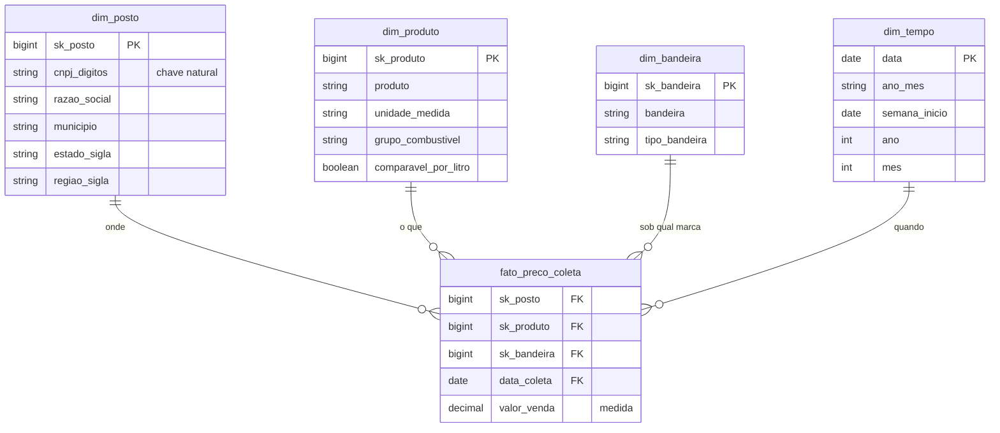

# MVP de Engenharia de Dados: preços de combustíveis para uma política de abastecimento de frota

Projeto final (MVP) da Sprint 3, Engenharia de Dados, da Pós-Graduação em Ciência de Dados e
Analytics. Trabalho individual.

O projeto consiste em um pipeline de dados construído no Databricks sobre a Série Histórica de Preços
de Combustíveis da ANP. O fluxo parte dos arquivos publicados pela agência, passa pelas camadas
bronze, silver e gold da arquitetura medalhão e termina em um modelo estrela, usado para responder a
cinco perguntas de negócio.

## Contexto de Negócios e Perguntas (Etapa 2 e 4.1)

### Problema

O cenário considerado é o de uma empresa com frota própria, composta por carros de vendedores
externos e caminhões de entrega, que não tem critério definido de abastecimento. Cada motorista
escolhe o posto e o combustível, e o valor de reembolso é o mesmo em todo o país. Como o combustível
é um dos principais custos da operação, a área de Compras precisa de dados para decidir onde
abastecer, com qual combustível e em que tipo de posto, além de revisar o reembolso por estado e
projetar o orçamento do ano seguinte.

### Perguntas

| # | Pergunta | Decisão que ela apoia |
|---|---|---|
| P1 | Como o preço médio de cada combustível evoluiu mês a mês entre julho de 2025 e junho de 2026? | Revisão do orçamento e do valor de reembolso |
| P2 | Quais estados têm a gasolina comum e o diesel S10 mais caros e mais baratos, e qual a diferença percentual entre os extremos? | Reembolso por estado e escolha de onde abastecer em viagem longa |
| P3 | Em quais estados compensa abastecer os carros flex com etanol, considerando a referência de 70% do preço da gasolina, e isso muda ao longo do ano? | Política de combustível por estado |
| P4 | Postos bandeirados cobram mais que postos de bandeira branca? Qual a diferença, e ela se mantém em todas as regiões? | Autorizar ou não o abastecimento em bandeira branca |
| P5 | Dentro do mesmo município e na mesma semana, qual a diferença entre o posto mais barato e o mais caro? Em quais municípios essa dispersão é maior? | Onde vale negociar convênio com postos |

A referência de 70% usada na P3 vem do rendimento do etanol: por ter menor poder calorífico, ele
rende cerca de 70% do que a gasolina rende por litro. Quando o preço do etanol passa de 70% do preço
da gasolina, o custo por quilômetro rodado fica maior, mesmo com o litro mais barato.

As definições de posto bandeirado e de bandeira branca seguem o dicionário de metadados da ANP. O
posto bandeirado exibe a marca de uma distribuidora e só pode vender combustível dela; o de bandeira
branca não exibe marca e pode comprar de qualquer distribuidora.

### Granularidade e frequência de atualização

O menor nível de detalhe disponível é o preço de um combustível em um posto em uma data de coleta, e
foi nesse nível que as tabelas finais foram mantidas. As agregações por semana, mês, município,
estado e região são feitas nas consultas.

Como a pesquisa da ANP é semanal, não há motivo para processamento em tempo real. Neste MVP a carga é
feita em lote, a partir dos arquivos semestrais; em produção, o mesmo pipeline poderia ser executado
semanal ou mensalmente, incorporando os arquivos novos.

### Contexto dos dados brutos

| Item | Descrição |
|---|---|
| Fonte | ANP / SDC (Superintendência de Defesa da Concorrência), Levantamento de Preços de Combustíveis |
| Como é coletado | Pesquisa semanal presencial de preço ao consumidor, executada por empresa contratada, em amostra de postos revendedores |
| Base legal | Lei 9.478/1997 (Lei do Petróleo), artigo 8º |
| Período usado | Julho de 2025 a junho de 2026 |
| Volume | 806.626 registros, em dois arquivos CSV (63,7 MB e 72,1 MB) |
| Cobertura | 27 unidades da federação, 417 pares de estado e município, 7.963 postos no primeiro semestre de 2026 |
| Produtos | Gasolina comum, gasolina aditivada, etanol hidratado, diesel, diesel S10 e GNV |

Por se tratar de uma pesquisa amostral, e não de um censo dos postos, as conclusões valem para os
municípios pesquisados.

A base não contém dados pessoais. Os registros identificam pessoas jurídicas (CNPJ, razão social e
endereço comercial do posto) e são de publicação obrigatória por lei, o que dispensa anonimização.

### Estrutura dos dados brutos

Cada arquivo semestral é uma tabela única, com uma linha por preço coletado e 16 colunas, sem
arquivos relacionados. O formato é CSV com separador ponto e vírgula, codificação UTF-8 com BOM,
quebra de linha CRLF, decimal com vírgula e datas no formato dd/mm/aaaa.

| Coluna | Conteúdo |
|---|---|
| Regiao - Sigla, Estado - Sigla, Municipio | Localização do posto |
| Revenda, CNPJ da Revenda | Identificação do posto |
| Nome da Rua, Numero Rua, Complemento, Bairro, Cep | Endereço do posto |
| Produto | Combustível pesquisado |
| Data da Coleta | Data da pesquisa em campo |
| Valor de Venda | Preço ao consumidor, medida principal da análise |
| Valor de Compra | Preço de distribuição, descontinuado desde agosto de 2020 |
| Unidade de Medida | R$/litro para os combustíveis líquidos, R$/m³ para o GNV |
| Bandeira | Marca da distribuidora exibida pelo posto, ou BRANCA |

Na modelagem, o posto é identificado pelo CNPJ da revenda e a localidade, pelo par estado e
município. O produto e a data da coleta completam a identificação de cada registro.

### Licença dos dados

A página do conjunto na ANP não indica uma licença específica. Os dados são publicados no âmbito da
Política de Dados Abertos do Poder Executivo federal, instituída pelo Decreto nº 8.777/2016, que no
artigo 2º, inciso III, define dado aberto como aquele disponibilizado "sob licença aberta que permita
sua livre utilização, consumo ou cruzamento, limitando-se a creditar a autoria ou a fonte". O uso, a
transformação e o cruzamento dos dados são, portanto, permitidos, desde que a ANP seja citada como
fonte.

O rodapé do site da ANP exibe a licença Creative Commons Atribuição-SemDerivações 3.0, que proíbe
obras derivadas. Essa licença se aplica ao conteúdo editorial do portal, e não aos conjuntos
publicados como dados abertos, que seguem o decreto citado.

Fonte: ANP, Série Histórica de Preços de Combustíveis.
https://www.gov.br/anp/pt-br/centrais-de-conteudo/dados-abertos/serie-historica-de-precos-de-combustiveis

## Carga dos Dados (Etapa 4.2)

A coleta foi feita por download manual dos arquivos e upload pela interface do Databricks, que é o
caso simples previsto no enunciado. Essa opção foi escolhida por dois motivos: a Free Edition
restringe o acesso de saída à internet, o que torna pouco confiável baixar os arquivos de dentro do
notebook, e o volume de dados não justificava um processo automatizado de coleta.

Etapas executadas:

1. Download dos dois arquivos semestrais, em formato ZIP, na página de dados abertos da ANP.
2. Descompactação local, que resultou em `Precos_semestrais_-_AUTOMOTIVOS_2025.02.csv` (63,7 MB) e
   `Precos_semestrais_-_AUTOMOTIVOS_2026.01.csv` (72,1 MB).
3. Upload dos dois arquivos para o volume `combustiveis.bronze.arquivos_anp`, no Unity Catalog, sem
   alteração de conteúdo.
4. Leitura dos arquivos pelo notebook de ingestão e gravação da tabela Delta `bronze.precos_anp`.

Os arquivos originais permanecem no volume após a ingestão. Assim, um reprocessamento parte sempre do
mesmo conteúdo publicado pela ANP, sem depender de a página de origem continuar disponível.

Durante a coleta foram registradas duas observações sobre a fonte, por afetarem a reprodutibilidade:

- Os arquivos mensais da ANP não seguem um padrão de nome: o de abril de 2026 foi publicado sem a
  extensão `.csv`, e o de fevereiro de 2026 tem um erro de digitação no nome. Por isso foram usados os
  arquivos semestrais, cujo padrão é estável.
- Os dois semestres, embora venham do mesmo levantamento, não têm a mesma formatação. As diferenças
  estão detalhadas na seção de qualidade.

Estrutura criada no Unity Catalog:

```
combustiveis                        catálogo do projeto
├── bronze                          dado como veio
│   ├── arquivos_anp (volume)       CSV originais
│   ├── precos_anp                  tabela Delta, 806.626 linhas
│   └── perfil_completude           perfil de qualidade da bronze
├── silver                          dado tipado e padronizado
│   ├── precos                      806.620 linhas
│   ├── log_transformacoes          registro das transformações
│   └── perfil_completude           perfil de qualidade da silver
└── gold                            modelo estrela
    ├── fato_preco_coleta           806.620 linhas
    ├── dim_posto                   9.189 postos
    ├── dim_produto                 6 combustíveis
    ├── dim_bandeira                49 bandeiras
    └── dim_tempo                   365 dias
```

Foi adotado um catálogo para o projeto, com uma camada por schema. O enunciado sugere um catálogo por
camada, o que também seria válido; com o catálogo único, os nomes qualificados ficam mais curtos nas
consultas entre camadas e a governança do projeto fica concentrada em um só objeto.

Scripts: [`notebooks/00_setup_ambiente.sql`](notebooks/00_setup_ambiente.sql) cria o catálogo, os
schemas e o volume; [`notebooks/01_bronze_ingestao.py`](notebooks/01_bronze_ingestao.py) carrega os
arquivos.


Para conferir a carga, a contagem de linhas por arquivo foi comparada com a contagem feita nos CSV
antes do upload: 384.208 linhas no arquivo de 2025.02 e 422.418 no de 2026.01, com total de 806.626.
Os valores coincidem, o que mostra que nenhuma linha foi perdida no envio para a nuvem.

## Modelagem e Catálogo de Dados (Etapa 4.3)

### Modelo escolhido

Foi adotado o esquema estrela, com uma tabela de fatos e quatro dimensões. O documento de desenho,
com as alternativas consideradas e a justificativa das decisões, está em
[`docs/modelagem.md`](docs/modelagem.md).

A fonte é um arquivo plano, em que o contexto se repete em todas as linhas: o endereço de um posto,
por exemplo, aparece novamente a cada coleta. Nas 806.620 linhas, o cadastro dos 9.189 postos é
repetido dezenas de vezes. O esquema estrela separa os eventos (os preços coletados) do contexto
(posto, produto, bandeira e data), o que elimina essa repetição e organiza os dados no formato que as
perguntas exigem, já que todas envolvem médias de preço agrupadas por algum atributo.

O esquema snowflake foi descartado porque separar município e estado em tabelas próprias acrescentaria
junções sem ganho prático nesse volume de dados. O modelo plano foi descartado por ser o formato que
a fonte já entrega.

### Grão

Cada linha da `fato_preco_coleta` corresponde ao preço de um combustível, em um posto, em uma data de
coleta. É o nível mais detalhado que a fonte oferece, o que mantém possíveis todas as agregações. Se
a fato fosse gravada já agregada por mês e estado, a P5, que compara postos de um mesmo município na
mesma semana, não poderia ser respondida.

### Diagrama



### Decisões de modelagem motivadas pela análise de qualidade

A bandeira foi associada à tabela de fatos, e não à dimensão de posto. O perfil de qualidade mostrou
359 postos com mais de uma bandeira ao longo dos doze meses, o que corresponde a trocas de
distribuidora. Se a bandeira fosse um atributo fixo do posto, todo o histórico passaria a aparecer sob
a marca mais recente, e a P4 seria calculada com informação incorreta.

A dimensão de posto guarda a versão cadastral mais recente de cada posto, o que corresponde a uma
dimensão de mudança lenta do tipo 1: o valor anterior é sobrescrito e o histórico do atributo não é
mantido (KIMBALL; ROSS, 2013). A simplificação é aceitável porque nenhuma das perguntas depende do
endereço anterior de um posto. A bandeira, cujo histórico importa para a análise, ficou fora dessa
dimensão pelo motivo descrito acima.

### Catálogo de dados

As 10 tabelas e as 83 colunas do projeto têm descrição gravada no Unity Catalog, por meio de
`COMMENT ON TABLE` e `COMMENT ON COLUMN`, no script
[`notebooks/06_catalogo_dados.sql`](notebooks/06_catalogo_dados.sql). Uma consulta ao
`information_schema` confirma que nenhuma coluna ficou sem descrição.


A transcrição do catálogo está a seguir. Os domínios se referem ao período carregado, de julho de 2025
a junho de 2026.

#### gold.fato_preco_coleta

Tabela de fatos do modelo estrela. Grão: um preço, de um combustível, em um posto, em uma data de
coleta. Linhagem: derivada de `silver.precos` por junção com `dim_produto` (produto e unidade),
`dim_bandeira` (bandeira) e `dim_posto` (CNPJ apenas com dígitos), substituindo os atributos pelas
chaves das dimensões.

| Campo | Tipo | Descrição e domínio |
|---|---|---|
| sk_posto | bigint | Chave substituta do posto. Junção com `dim_posto` |
| sk_produto | bigint | Chave substituta do combustível. Junção com `dim_produto` |
| sk_bandeira | bigint | Chave substituta da bandeira exibida na data da coleta. Fica na fato, e não na dimensão do posto, porque 359 postos trocaram de bandeira no período |
| data_coleta | date | Data da coleta. Junção com `dim_tempo`. Domínio: 2025-07-01 a 2026-06-30 |
| valor_venda | decimal(6,3) | Medida: preço de venda ao consumidor, na unidade do produto. Domínio: 2,890 a 9,990. Preços de GNV estão em R$ por metro cúbico e não entram na mesma média dos líquidos |

#### gold.dim_posto

Um registro por posto, identificado pelo CNPJ. Guarda a versão cadastral mais recente observada.
Linhagem: derivada de `silver.precos`. 9.189 registros.

| Campo | Tipo | Descrição e domínio |
|---|---|---|
| sk_posto | bigint | Chave substituta, inteiro sequencial |
| cnpj_digitos | string | Chave natural: CNPJ apenas com dígitos, 14 caracteres |
| cnpj | string | CNPJ com máscara, para leitura |
| razao_social | string | Razão social do posto |
| logradouro | string | Logradouro do posto |
| numero | string | Número do logradouro, ou S/N |
| complemento | string | Complemento do endereço, opcional |
| bairro | string | Bairro do posto |
| cep | string | CEP no formato 00000-000 |
| municipio | string | Município do posto. Usar com `estado_sigla`, porque há nome repetido entre estados |
| estado_sigla | string | UF do posto. Domínio: as 27 UFs |
| regiao_sigla | string | Região. Domínio: N, NE, CO, SE, S |

#### gold.dim_produto

Um registro por combinação de produto e unidade de medida. Linhagem: derivada de `silver.precos`.
6 registros.

| Campo | Tipo | Descrição e domínio |
|---|---|---|
| sk_produto | bigint | Chave substituta, inteiro sequencial |
| produto | string | Nome do combustível como a ANP publica. Domínio: GASOLINA, GASOLINA ADITIVADA, ETANOL, DIESEL, DIESEL S10, GNV |
| unidade_medida | string | Unidade do preço. Domínio: R$ / litro, R$ / m3 |
| grupo_combustivel | string | Agrupamento derivado do nome. Domínio: GASOLINA, ETANOL, DIESEL, GNV |
| comparavel_por_litro | boolean | Indica se o preço pode entrar em comparações por litro. Falso apenas para o GNV |

#### gold.dim_bandeira

Um registro por marca exibida. Linhagem: derivada de `silver.precos`. 49 registros.

| Campo | Tipo | Descrição e domínio |
|---|---|---|
| sk_bandeira | bigint | Chave substituta, inteiro sequencial |
| bandeira | string | Marca da distribuidora exibida pelo posto, ou BRANCA. 49 valores distintos |
| tipo_bandeira | string | Classificação. Domínio: BANDEIRADO, BRANCA, conforme a definição da ANP |

#### gold.dim_tempo

Um registro por dia entre a primeira e a última coleta, incluindo dias sem coleta. Linhagem: gerada a
partir dos limites de data de `silver.precos`. 365 registros.

| Campo | Tipo | Descrição e domínio |
|---|---|---|
| data | date | Chave da dimensão. Domínio: 2025-07-01 a 2026-06-30 |
| ano | int | Ano civil. Domínio: 2025, 2026 |
| mes | int | Mês. Domínio: 1 a 12 |
| dia | int | Dia do mês. Domínio: 1 a 31 |
| ano_mes | string | Formato aaaa-mm, usado nas séries mensais |
| semana_inicio | date | Segunda-feira em que a semana começa. É a chave de agrupamento semanal, porque rótulos de ano e número de semana são ambíguos na virada do ano |
| ano_semana | string | Rótulo da semana no formato aaaa-Snn, apenas para leitura |
| trimestre | int | Domínio: 1 a 4 |
| semestre | int | Domínio: 1, 2 |
| dia_semana | string | Nome do dia da semana, em inglês |

#### silver.precos

Preços tipados, padronizados e sem duplicatas. Linhagem: derivada de `bronze.precos_anp` por oito
transformações registradas em `silver.log_transformacoes`. 806.620 linhas.

| Campo | Tipo | Descrição e domínio |
|---|---|---|
| regiao_sigla | string | Região do posto. Domínio: N, NE, CO, SE, S |
| estado_sigla | string | UF do posto. Domínio: as 27 UFs |
| municipio | string | Município do posto |
| razao_social | string | Razão social. Origem: coluna `Revenda` da bronze |
| cnpj | string | CNPJ com máscara, sem o espaço à esquerda |
| cnpj_digitos | string | CNPJ apenas com dígitos, chave natural do posto |
| logradouro | string | Origem: coluna `Nome da Rua` da bronze |
| numero | string | Número do logradouro; variantes de sem número unificadas em S/N |
| complemento | string | Complemento do endereço, opcional |
| bairro | string | Bairro do posto |
| cep | string | CEP no formato 00000-000 |
| produto | string | Combustível pesquisado, 6 valores |
| unidade_medida | string | Domínio: R$ / litro, R$ / m3, com as grafias do GNV unificadas |
| bandeira | string | Marca exibida na data da coleta, ou BRANCA |
| data_coleta | date | Convertida do texto dd/mm/aaaa. Domínio: 2025-07-01 a 2026-06-30 |
| valor_venda | decimal(6,3) | Preço ao consumidor. Domínio: 2,890 a 9,990 |
| _arquivo_origem | string | Metadado de controle herdado da bronze |
| _data_ingestao | timestamp | Metadado de controle herdado da bronze |
| _data_processamento_silver | timestamp | Metadado de controle desta camada |

#### bronze.precos_anp

Dados como publicados pela ANP, sem tratamento, com todas as colunas em texto. 806.626 linhas. Os
nomes das colunas foram padronizados na ingestão, já que o cabeçalho original usa nomes como
`Regiao - Sigla` e traz um marcador BOM no início do arquivo; os valores não foram alterados. A
descrição de cada coluna está gravada no Unity Catalog. As 16 colunas correspondem às listadas em
"Estrutura dos dados brutos", acrescidas de `_arquivo_origem` e `_data_ingestao`.

#### Tabelas de apoio

| Tabela | Conteúdo |
|---|---|
| `bronze.perfil_completude` | Nulos, vazios e percentual de ausência por coluna da bronze. Gerada pelo notebook 02 |
| `silver.perfil_completude` | Mesma medição na silver. Gerada pelo notebook 05, para comparação |
| `silver.log_transformacoes` | Transformação, motivo e linhas afetadas por cada passo da silver. Gerada pelo notebook 03 |

## Pipeline de Dados (Etapa 4.4)

O pipeline foi dividido em oito notebooks, um por etapa. Cada notebook lê de uma camada e grava na
seguinte, o que permite reexecutar apenas a parte afetada por uma alteração e facilita localizar cada
transformação pelo nome do arquivo.

| Notebook | O que faz | Entrada | Saída |
|---|---|---|---|
| [`00_setup_ambiente.sql`](notebooks/00_setup_ambiente.sql) | Cria catálogo, schemas e volume | — | Estrutura do Unity Catalog |
| [`01_bronze_ingestao.py`](notebooks/01_bronze_ingestao.py) | Lê os CSV e grava a bronze | Volume | `bronze.precos_anp` |
| [`02_qualidade_bronze.py`](notebooks/02_qualidade_bronze.py) | Perfil de qualidade dos dados brutos | `bronze.precos_anp` | `bronze.perfil_completude` |
| [`03_silver_limpeza.py`](notebooks/03_silver_limpeza.py) | Tipagem, padronização e remoção de duplicatas | `bronze.precos_anp` | `silver.precos`, `silver.log_transformacoes` |
| [`04_gold_modelo_estrela.py`](notebooks/04_gold_modelo_estrela.py) | Monta as dimensões e a fato | `silver.precos` | 5 tabelas em `gold` |
| [`05_qualidade_pos_pipeline.py`](notebooks/05_qualidade_pos_pipeline.py) | Repete as verificações nas tabelas finais | `silver`, `gold` | `silver.perfil_completude` |
| [`06_catalogo_dados.sql`](notebooks/06_catalogo_dados.sql) | Grava as descrições no Unity Catalog e verifica se alguma coluna ficou sem documentação | — | Metadados |
| [`07_analise_perguntas.py`](notebooks/07_analise_perguntas.py) | Responde às cinco perguntas | `gold` | Resultados |

Todas as gravações usam o modo `overwrite`, e os comandos de criação usam `IF NOT EXISTS`, de modo que
o pipeline pode ser executado mais de uma vez sem duplicar dados. Isso permite, por exemplo,
reexecutá-lo após uma falha sem verificar antes o que já havia sido processado.

### Transformações da camada silver

Cada transformação responde a um problema identificado no notebook 02. A quantidade de linhas afetadas
é gravada na tabela `silver.log_transformacoes` a cada execução, em vez de ser registrada manualmente.

| # | Transformação | Motivo | Linhas afetadas |
|---|---|---|---|
| 1 | Remoção de duplicatas exatas | Coletas registradas duas vezes pesariam em dobro na média do posto | 6 |
| 2 | Padronização de espaços em campos de texto | Espaço à esquerda no CNPJ em todo o arquivo de 2026.01 e espaços duplos em endereços; sem essa etapa, o mesmo posto viraria dois registros na dimensão | 461.587 |
| 3 | Conversão do preço para `decimal(6,3)` | Preço publicado como texto com vírgula decimal, em três formatos diferentes | 806.620 |
| 4 | Conversão da data para `date` | Data publicada como texto dd/mm/aaaa; a ordenação alfabética colocaria 01/12 antes de 02/07 | 806.620 |
| 5 | Criação do CNPJ apenas com dígitos | Chave natural que não depende da máscara usada pela fonte | 806.620 |
| 6 | Unificação da grafia da unidade de medida | GNV publicado com duas grafias, uma em cada arquivo | 17.169 |
| 7 | Padronização do número do logradouro | Quatro variantes de "sem número" na fonte | 86.563 |
| 8 | Descarte da coluna `valor_compra` | Coluna vazia desde agosto de 2020, que poderia ser usada por engano em cálculos de margem | 806.626 |

### Montagem da camada gold

A fato é construída a partir da silver por meio de três junções, que substituem os atributos
descritivos pelas chaves substitutas: com a `dim_produto`, pelo produto e pela unidade de medida; com
a `dim_bandeira`, pela bandeira; e com a `dim_posto`, pelo CNPJ apenas com dígitos. A data permanece
como chave da dimensão de tempo.

Como as dimensões são derivadas da própria silver, todas as linhas devem encontrar correspondência. A
validação confirmou esse resultado: a fato tem as mesmas 806.620 linhas da silver e nenhuma chave
nula.


## Qualidade de Dados (Etapa 4.5)

A qualidade foi verificada em dois momentos: sobre os dados brutos, logo após a ingestão, e sobre as
tabelas finais, depois do pipeline. A comparação entre as duas medições permite mostrar quais
problemas foram resolvidos e quais foram mantidos por decisão.

### Problemas encontrados nos dados brutos

Foram verificadas, para cada atributo, as cinco dimensões de qualidade pedidas no enunciado, no
notebook [`02_qualidade_bronze.py`](notebooks/02_qualidade_bronze.py).

| Dimensão | Resultado |
|---|---|
| Completude | `valor_compra` ausente em 100% das linhas; `complemento` em 77,38%; `bairro` em 0,17% |
| Consistência | 253 preços fora do padrão com vírgula decimal; 422.418 CNPJ com espaço à esquerda; 106.395 números de logradouro não numéricos; duas grafias para a unidade do GNV |
| Unicidade | 6 linhas duplicadas exatas, que também repetem a chave de negócio |
| Acurácia | Nenhum preço nulo ou não positivo; faixas por combustível compatíveis com o mercado; 12 meses de cobertura, sem mês faltando |
| Outliers | Entre 1,36% e 1,94% das coletas fora do intervalo entre o percentil 1 e o percentil 99 de cada produto |

A análise também mostrou que os dois arquivos, mesmo sendo do mesmo levantamento e da mesma agência,
seguem padrões de formatação diferentes. O CNPJ com espaço à esquerda aparece em todas as 422.418
linhas do arquivo de janeiro a junho de 2026 e em nenhuma do arquivo anterior. Os 253 preços sem
vírgula e os 6.627 preços com uma casa decimal estão todos no arquivo de julho a dezembro de 2025. A
unidade do GNV é grafada `R$ / m3` em um arquivo e `R$ / m³` no outro.

Essas diferenças não estão documentadas pela fonte e justificam a separação entre as camadas bronze e
silver. A bronze guarda os dados como foram publicados, com as divergências, e a padronização é feita
na silver, com registro do que foi alterado. Se os dados tivessem sido corrigidos já na entrada, a
diferença entre os arquivos não ficaria registrada, e uma nova mudança de formato em publicações
futuras seria mais difícil de identificar.

### Tratamento de cada problema

| Problema | Dimensão | Tratamento |
|---|---|---|
| `valor_compra` inteiramente vazia | Completude | Coluna descartada, com o motivo registrado no catálogo |
| `complemento` ausente na maior parte das linhas | Completude | Mantida, por ser um campo opcional do endereço |
| Preço como texto, em três formatos | Consistência | Convertido para `decimal(6,3)`, sem conversões perdidas |
| Data como texto | Consistência | Convertida para `date` |
| CNPJ com espaço e com máscara | Consistência | Espaço removido, máscara preservada para leitura e versão apenas com dígitos criada como chave |
| Quatro formas de "sem número" | Consistência | Unificadas em S/N |
| Duas grafias da unidade do GNV | Consistência | Unificadas em `R$ / m3` |
| 6 linhas duplicadas | Unicidade | Removidas |
| Nome de município repetido entre estados | Chave | Localidade sempre identificada pelo par estado e município |
| Posto com mais de uma bandeira no período | Modelagem | Bandeira tratada como atributo da coleta, na tabela de fatos |
| Preços extremos | Outliers | Mantidos, com o intervalo documentado |

### Comparação antes e depois

As mesmas verificações foram repetidas nas tabelas finais, no notebook
[`05_qualidade_pos_pipeline.py`](notebooks/05_qualidade_pos_pipeline.py).

| Verificação | Bronze | Tabelas finais |
|---|---|---|
| Preços fora do padrão | 253 | 0 |
| Datas fora do formato | 0 | 0 |
| CNPJ com espaço | 422.418 | 0 |
| CNPJ sem 14 dígitos | — | 0 |
| Grafias de unidade de medida | 3 | 2 |
| Formas de "sem número" | 4 | 1 |
| Duplicatas da chave de negócio | 6 | 0 |
| Chaves órfãs na fato | — | 0 nas quatro dimensões |
| Linhas | 806.626 | 806.620 |


A diferença de seis linhas entre a bronze e as tabelas finais corresponde à remoção das duplicatas
exatas, registrada no log de transformações. A silver e a fato têm o mesmo total, o que mostra que
nenhuma outra linha foi perdida.

### Tratamento dos outliers

Os preços extremos foram mantidos na base. Ao analisar sua distribuição por estado, verificou-se que
eles se concentram em estados com custo logístico alto, o que indica diferença regional de preço, e
não erro de registro.

| Estado | Coletas de gasolina | Acima do percentil 99 | Proporção do estado | Preço médio do estado |
|---|---|---|---|---|
| AC | 625 | 158 | 25,28% | 7,541 |
| RR | 741 | 174 | 23,48% | 7,159 |
| AM | 2.725 | 362 | 13,28% | 7,229 |
| BA | 9.958 | 485 | 4,87% | 6,722 |
| SP | 61.148 | 562 | 0,92% | 6,243 |

A primeira versão dessa consulta ordenava os estados pela contagem absoluta e colocava São Paulo em
primeiro lugar, com 562 coletas acima do percentil 99. Isso ocorria apenas porque o estado tem a
maior amostra, com 61.148 coletas. Em proporção, São Paulo fica em 0,92%, enquanto Acre e Roraima
passam de 23%. A exclusão desses valores eliminaria justamente a diferença regional que a P2 procura
medir.

## Análise de Dados (Etapa 4.5)

As consultas estão no notebook [`07_analise_perguntas.py`](notebooks/07_analise_perguntas.py). O GNV
foi excluído das comparações por litro, por ser vendido em metro cúbico; essa regra está representada
no modelo pela coluna `comparavel_por_litro` da dimensão de produto.

### P1 - Evolução mensal do preço por combustível

| Combustível | Jul/2025 | Jun/2026 | Variação | Menor média mensal | Maior média mensal |
|---|---|---|---|---|---|
| Diesel S10 | 6,103 | 7,120 | +16,67% | 6,103 | 7,467 |
| Diesel | 6,050 | 6,874 | +13,63% | 6,048 | 7,339 |
| Gasolina | 6,211 | 6,657 | +7,17% | 6,182 | 6,762 |
| Gasolina aditivada | 6,416 | 6,856 | +6,85% | 6,389 | 6,960 |
| Etanol | 4,376 | 4,447 | +1,62% | 4,366 | 4,868 |


Os preços não subiram de forma contínua ao longo do período. Os cinco combustíveis ficaram
praticamente estáveis de julho de 2025 a fevereiro de 2026, subiram de forma acentuada entre março e
abril e recuaram em parte nos meses seguintes. O diesel comum, por exemplo, passou de 6,062 em
dezembro para 7,009 em março e 7,339 em abril, e fechou junho em 6,874, ainda acima do patamar
anterior.

A variação foi bem diferente entre os combustíveis. O diesel S10, usado pelos caminhões, subiu 16,67%
no período, mais que o dobro da alta da gasolina (7,17%), usada pelos carros dos vendedores. Uma
projeção de orçamento baseada na média geral dos combustíveis subestimaria o custo da frota pesada e
superestimaria o da frota leve, por isso as duas precisam ser projetadas separadamente.

O etanol teve um comportamento próprio. O preço começou a subir em dezembro, antes dos demais
combustíveis, atingiu a maior média mensal (4,868) entre março e abril e voltou em junho a um nível
próximo ao de julho de 2025, com variação de apenas 1,62% no período. Esse movimento é compatível com
a entressafra da cana-de-açúcar no Centro-Sul, que vai aproximadamente de dezembro a março, mas a base
não permite confirmar a causa.

### P2 - Estados mais caros e mais baratos

| Combustível | Estado mais caro | Preço | Estado mais barato | Preço | Diferença |
|---|---|---|---|---|---|
| Diesel S10 | AC | 7,848 | SE | 6,269 | R$ 1,579 (25,19%) |
| Gasolina | AC | 7,541 | PI | 6,129 | R$ 1,412 (23,04%) |

Os cinco estados mais caros em diesel S10 são AC (7,848), AM (7,085), RR (7,055), BA (6,819) e RO
(6,771), quatro deles da região Norte. São Paulo, que tem a maior amostra do país, fica 1,14% abaixo
da média nacional.


No diesel S10, o preço médio no Acre foi 25,19% maior que em Sergipe; na gasolina, a diferença entre
Acre e Piauí foi de 23,04%. Com diferenças dessa ordem, um valor único de reembolso para todo o país
não é adequado: ele tende a ficar acima do necessário em estados como Sergipe e Piauí e abaixo do
necessário nos estados do Norte. Em rotas longas que atravessam divisas, também faz sentido orientar
os motoristas a abastecer antes de entrar nos estados mais caros.

A concentração dos preços mais altos na região Norte é compatível com a distância dos centros de
refino e distribuição e com o custo de transporte até esses estados. A base, porém, não traz custos
de frete nem margens de distribuição e revenda, então não é possível separar os fatores que compõem a
diferença.

### P3 - Onde compensa abastecer com etanol

Razão entre o preço médio do etanol e o da gasolina, no período completo. Abaixo de 0,70, o etanol
compensa.

| Estado | Etanol | Gasolina | Razão | Decisão | Meses compensando |
|---|---|---|---|---|---|
| MS | 4,173 | 6,310 | 0,6614 | Compensa | 12 de 12 |
| MT | 4,312 | 6,467 | 0,6668 | Compensa | 10 de 12 |
| SP | 4,195 | 6,243 | 0,6720 | Compensa | 10 de 12 |
| PR | 4,513 | 6,527 | 0,6914 | Compensa | 8 de 12 |
| GO | 4,587 | 6,420 | 0,7146 | Não compensa | 5 de 12 |
| MG | 4,464 | 6,226 | 0,7170 | Não compensa | 4 de 12 |
| DF | 4,679 | 6,410 | 0,7285 | Não compensa | 2 de 12 |

Nos 20 estados restantes, a razão ficou acima de 0,70 em todos os meses do período.


Na média do período, o etanol compensou em quatro estados: Mato Grosso do Sul, Mato Grosso, São Paulo
e Paraná, todos grandes produtores de etanol. A proximidade das usinas reduz o custo de transporte do
combustível, o que é coerente com a razão mais baixa nesses estados.

A contagem de meses em que a razão ficou abaixo de 0,70 é mais útil para a decisão do que a média
anual. Em Mato Grosso do Sul, o etanol compensou nos 12 meses, o que permite adotar uma regra fixa. Em
Goiás e Minas Gerais, a vantagem apareceu em 5 e 4 meses, respectivamente; nesses estados, uma regra
fixa estaria errada em parte do ano, e a decisão precisa ser revista periodicamente. Como a ANP
atualiza os dados toda semana e o pipeline pode ser reexecutado, essa revisão pode ser feita
mensalmente. A variação do etanol ao longo do ano, observada na P1, ajuda a explicar por que esses
estados alternam entre meses em que o etanol compensa e meses em que não compensa.

O limite de 70% é uma referência média de rendimento dos motores flex. Cada modelo de veículo tem um
rendimento próprio, e uma decisão mais precisa dependeria do consumo real da frota, que não está
disponível nesta base.

### P4 - Bandeirado contra bandeira branca

Comparação feita dentro de cada estado, para a gasolina comum.

| Resultado | Valor |
|---|---|
| Estados comparados | 27 |
| Estados em que a bandeira branca é mais barata | 19 |
| Diferença média | R$ 0,036 por litro (0,65%) |
| Diferença mediana | R$ 0,052 por litro |

Estados com a maior vantagem para a bandeira branca: MS (5,57%), SP (4,56%), PR (3,27%), PA (2,90%),
AC (2,78%) e MT (2,34%).


Na média dos estados, a diferença entre os dois tipos de posto é pequena, de 0,65%, o que equivale a
R$ 0,036 por litro. Esse resultado agregado encobre situações bem diferentes. Em 8 dos 27 estados o
posto bandeirado foi mais barato, e em 6 estados a bandeira branca foi mais de 2% mais barata, com
diferenças acima de 4% em Mato Grosso do Sul e em São Paulo. No Amazonas ocorreu o oposto: a bandeira
branca foi 8,85% mais cara, com apenas 292 coletas desse tipo de posto no estado, contra 2.433 de
postos bandeirados.

Por isso, a recomendação é liberar o abastecimento em bandeira branca por estado, onde a diferença for
relevante, em vez de adotar uma regra nacional. A comparação dentro de cada estado evita confundir o
efeito da marca com o efeito regional, mas não elimina diferenças de composição dentro do próprio
estado, como uma possível concentração de postos de bandeira branca em determinadas cidades. Além
disso, o preço não é o único critério: contratos de frota costumam envolver rede credenciada e
condições comerciais que podem pesar mais do que alguns centavos por litro.

### P5 - Dispersão dentro do mesmo município

Comparação entre o posto mais barato e o mais caro do mesmo município, na mesma semana, para a gasolina
comum, considerando apenas grupos com pelo menos cinco postos pesquisados.

| Resultado | Valor |
|---|---|
| Grupos município-semana analisados | 17.383 |
| Amplitude média entre o mais barato e o mais caro | R$ 0,473 |
| Amplitude mediana | R$ 0,400 |
| Economia média contra a média local | R$ 0,224 por litro (3,53%) |

Municípios com maior dispersão média:

| Estado | Município | Amplitude média | Amplitude em % |
|---|---|---|---|
| SP | Guarujá | R$ 3,222 | 47,90% |
| SP | São Paulo | R$ 3,189 | 51,07% |
| SP | Barueri | R$ 2,879 | 40,88% |
| RJ | Rio de Janeiro | R$ 2,207 | 35,66% |
| SP | Taboão da Serra | R$ 2,171 | 35,14% |
| PE | Serra Talhada | R$ 1,683 | 26,61% |


Nos grupos analisados, o posto mais barato do município ficou, em média, R$ 0,224 abaixo da média
local, o que equivale a 3,53% do preço. A título de ilustração, para uma frota que consuma 10 mil
litros por mês, essa diferença representaria cerca de R$ 2.240 mensais.

Nas cidades maiores, a dispersão é bem mais alta. Em São Paulo, a diferença média entre o posto mais
barato e o mais caro na mesma semana passou de R$ 3,00 por litro. O município tem, em média, 205
postos pesquisados por semana, e uma amplitude desse tamanho reflete a presença de postos com perfis
e localizações muito diferentes, e não necessariamente a diferença entre postos próximos. Os
municípios com dispersão alta e grande volume de abastecimento são os candidatos mais indicados para a
negociação de convênios com postos.

### Discussão geral

O problema inicial era a ausência de critério de abastecimento e o uso de um reembolso único em todo
o país. As respostas mostram que essa uniformidade tem custo em três aspectos: o estado onde se
abastece (diferença de até 25% no diesel S10), o combustível usado nos carros flex (o etanol compensa
em apenas quatro estados) e a escolha do posto dentro do município (economia média de 3,53%, maior
nas cidades grandes). A evolução dos preços acrescenta um quarto ponto: como o diesel S10 subiu 16,67%
e a gasolina 7,17%, os orçamentos da frota pesada e da frota leve devem ser projetados separadamente.

Esses três aspectos exigem esforços diferentes. Mudar o estado de abastecimento depende da rota e nem
sempre é viável, e trocar o combustível só se aplica aos veículos flex nos quatro estados em que o
etanol compensa. A escolha do posto dentro da cidade, por outro lado, pode ser adotada em qualquer
lugar, com orientação aos motoristas ou convênios, e tende a ser a medida mais simples de
implementar.

Do ponto de vista da engenharia de dados, algumas respostas só foram possíveis por decisões tomadas
na construção do pipeline. A P4 depende de a bandeira estar associada à coleta, e não ao posto; a P5
depende de a fato ter sido mantida no nível da coleta individual; e a interpretação correta dos
outliers dependeu do uso de proporções no lugar de contagens absolutas.

## Autoavaliação

### Objetivos atingidos

Considero que os objetivos definidos no início foram atingidos. As cinco perguntas foram respondidas
com os dados carregados, sem que fosse necessário alterar ou retirar nenhuma delas. Em parte, isso se
deve ao fato de as perguntas terem sido definidas depois de verificar quais colunas a base realmente
continha: a ideia de calcular a margem de lucro dos postos, por exemplo, foi descartada logo no início,
porque a coluna `valor_compra` está vazia desde 2020.

O pipeline funciona de ponta a ponta, pode ser reexecutado sem duplicar dados e mantém o volume
rastreável: as seis linhas de diferença entre a origem e o destino são as duplicatas removidas,
registradas no log. As dez tabelas e as 83 colunas estão documentadas no Unity Catalog.

### Limitações

O trabalho usa uma única fonte de dados, sem junção entre bases diferentes. Isso é comum em pipelines
reais, mas limita o que a linhagem consegue demonstrar.

As respostas são descritivas. A P1 mostra um aumento de preços entre março e abril de 2026, mas a base
não permite explicar a causa, já que reajustes de refinaria, mudanças tributárias e custos de frete
não fazem parte dos dados.

Na P4, a comparação controla o estado, mas não a composição dentro de cada estado. Uma análise mais
rigorosa compararia postos bandeirados e de bandeira branca do mesmo município, ou usaria um modelo
capaz de isolar o efeito da marca das demais variáveis.

### Dificuldades encontradas

Uma dificuldade importante foi perceber que os dois arquivos da ANP, apesar de virem do mesmo
levantamento, não seguem o mesmo padrão de formatação, e que isso não está documentado. A partir daí,
cada suposição sobre o formato passou a ser verificada antes das conversões: nulos e textos vazios
foram contados separadamente, e os formatos foram validados com expressões regulares antes da
tipagem.

A primeira execução da dimensão de tempo falhou porque o padrão de data usado para obter o ano da
semana não é mais aceito pelo Spark 3. Na virada do ano, o ano civil e o ano da semana podem ser
diferentes, e a versão atual bloqueia esse padrão em vez de devolver um resultado ambíguo. A mensagem
de erro sugeria ativar o modo de compatibilidade antigo, mas preferi identificar a semana pela data da
segunda-feira em que ela começa, o que resolve a ambiguidade em vez de apenas esconder o erro.

No uso do Databricks, tive dificuldade para manter a Git folder sincronizada com o repositório. Os
notebooks guardam o resultado das células dentro do próprio arquivo, então cada execução deixava os
arquivos marcados como modificados. Depois que dois notebooks foram renomeados no repositório, isso
gerou um conflito na atualização, resolvido descartando as alterações locais, que eram apenas
resultados de execução. Também cheguei a executar notebooks sem antes atualizar a cópia do
Databricks, o que produziu resultados da versão anterior do código. Outro ponto foi a escolha do
recurso de computação: o SQL Warehouse executa apenas SQL, e os notebooks em Python precisaram rodar
no compute serverless de uso geral.

A consulta de outliers também precisou ser refeita, porque a primeira versão ordenava os estados pela
contagem absoluta e colocava São Paulo no topo apenas por ter a maior amostra.

### Trabalhos futuros

- Incluir uma segunda fonte, como a população por município do IBGE, para verificar se cidades maiores
  têm preço menor ou dispersão maior. Seria necessário padronizar o nome dos municípios, já que a base
  da ANP não traz o código do IBGE.
- Implementar carga incremental com os arquivos mensais da ANP, mostrando que o pipeline aceita dados
  novos sem ser reescrito.
- Acrescentar validações automáticas de formato na ingestão, com alerta quando a fonte mudar o padrão
  dos arquivos.
- Incluir dados de frete ou de distância até as bases de distribuição, para testar a relação entre o
  custo logístico e a diferença regional de preços.
- Estender a P1 com uma análise de assimetria de reajuste, verificando se os preços sobem mais rápido
  do que caem após um aumento como o observado entre março e abril de 2026.
- Configurar o repositório para não versionar os resultados de execução dos notebooks, evitando os
  conflitos de sincronização descritos acima.

## Referências

AGÊNCIA NACIONAL DO PETRÓLEO, GÁS NATURAL E BIOCOMBUSTÍVEIS (ANP). **Série histórica de preços de
combustíveis e de GLP**. Brasília, 2026. Disponível em:
https://www.gov.br/anp/pt-br/centrais-de-conteudo/dados-abertos/serie-historica-de-precos-de-combustiveis.
Acesso em: 21 set. 2026.

AGÊNCIA NACIONAL DO PETRÓLEO, GÁS NATURAL E BIOCOMBUSTÍVEIS (ANP). **Metadados: série histórica de
preços de combustíveis**. Brasília, 2026. Disponível em:
https://www.gov.br/anp/pt-br/centrais-de-conteudo/dados-abertos/arquivos/shpc/metadados-serie-historica-precos-combustiveis-1.pdf.
Acesso em: 21 set. 2026.

BRASIL. Decreto nº 8.777, de 11 de maio de 2016. Institui a Política de Dados Abertos do Poder
Executivo federal. Brasília, DF: Presidência da República, 2016. Disponível em:
https://www.planalto.gov.br/ccivil_03/_ato2015-2018/2016/decreto/d8777.htm. Acesso em: 21 set. 2026.

BRASIL. Lei nº 9.478, de 6 de agosto de 1997. Dispõe sobre a política energética nacional, as
atividades relativas ao monopólio do petróleo, institui o Conselho Nacional de Política Energética e
a Agência Nacional do Petróleo e dá outras providências. Brasília, DF: Presidência da República, 1997.
Disponível em: https://www.planalto.gov.br/ccivil_03/leis/l9478.htm. Acesso em: 21 set. 2026.

DAMA INTERNATIONAL. **DAMA-DMBOK**: data management body of knowledge. 2. ed. Basking Ridge: Technics
Publications, 2017.

DATABRICKS. **COMMENT ON**. Databricks on AWS, 2026. Disponível em:
https://docs.databricks.com/aws/en/sql/language-manual/sql-ref-syntax-ddl-comment. Acesso em: 24 set.
2026.

DATABRICKS. **What is the medallion lakehouse architecture?** Databricks on AWS, 2026. Disponível em:
https://docs.databricks.com/aws/en/lakehouse/medallion. Acesso em: 24 set. 2026.

KIMBALL, Ralph; ROSS, Margy. **The data warehouse toolkit**: the definitive guide to dimensional
modeling. 3. ed. Indianapolis: Wiley, 2013.
