# MVP de Engenharia de Dados: preços de combustíveis para uma política de abastecimento de frota

Pipeline de dados de ponta a ponta construído no Databricks sobre a Série Histórica de Preços de
Combustíveis da ANP. O fluxo vai do arquivo bruto publicado pela agência até as tabelas de um esquema
estrela usadas para responder às perguntas de negócio listadas abaixo.

Sprint 3 (Engenharia de Dados) da pós-graduação em Ciência de Dados e Analytics. Trabalho individual.

## Contexto de Negócios e Perguntas (Etapa 2 e 4.1)

### Problema

Uma empresa com frota própria, formada por carros de vendedores externos e caminhões de entrega, não
tem critério de abastecimento. Cada motorista escolhe o posto e o combustível, e o reembolso é igual
em todo o país. Combustível é o segundo maior custo da operação, atrás apenas de pessoal.

A área de Compras precisa decidir, com base em dados, onde abastecer, com qual combustível e em que
tipo de posto, além de revisar o valor de reembolso por estado e projetar o orçamento do próximo ano.

### Perguntas

| # | Pergunta | Decisão que ela apoia |
|---|---|---|
| P1 | Como o preço médio de cada combustível evoluiu mês a mês entre julho de 2025 e junho de 2026? | Revisão do orçamento e do valor de reembolso |
| P2 | Quais estados têm a gasolina comum e o diesel S10 mais caros e mais baratos, e qual a diferença percentual entre os extremos? | Reembolso por estado e escolha de onde abastecer em viagem longa |
| P3 | Em quais estados compensa abastecer os carros flex com etanol, considerando a referência de 70% do preço da gasolina, e isso muda ao longo do ano? | Política de combustível por estado |
| P4 | Postos bandeirados cobram mais que postos de bandeira branca? Qual a diferença, e ela se mantém em todas as regiões? | Autorizar ou não o abastecimento em bandeira branca |
| P5 | Dentro do mesmo município e na mesma semana, qual a diferença entre o posto mais barato e o mais caro? Em quais municípios essa dispersão é maior? | Onde vale negociar convênio com postos |

A referência de 70% na P3 vem do rendimento do etanol, que entrega cerca de 70% do que a gasolina
entrega por litro. Acima dessa proporção, o litro mais barato sai mais caro por quilômetro rodado.

Posto bandeirado é o que exibe a marca de uma distribuidora e só pode vender o combustível dela. Posto
de bandeira branca não exibe marca e compra de qualquer distribuidora. As duas definições são do
dicionário de metadados da ANP.

### Granularidade e frequência de atualização

O menor nível do dado é um preço, de um combustível, em um posto, em uma data de coleta. As tabelas
finais guardam esse nível, e semana, mês, município, estado e região saem por agregação.

A pesquisa da ANP é semanal, então processamento em tempo real não se justifica. Neste MVP a carga é
em lote, a partir dos arquivos semestrais. Em produção, o mesmo pipeline rodaria em carga semanal ou
mensal, acrescentando os arquivos novos.

### Contexto dos dados brutos

| Item | Descrição |
|---|---|
| Fonte | ANP / SDC (Superintendência de Defesa da Concorrência), Levantamento de Preços de Combustíveis |
| Como é coletado | Pesquisa semanal presencial de preço ao consumidor, executada por empresa contratada, em amostra de postos revendedores |
| Base legal | Lei 9.478/1997 (Lei do Petróleo), artigo 8º |
| Período usado | Julho de 2025 a junho de 2026 |
| Volume | 806.626 registros, em dois arquivos CSV (63,7 MB e 72,1 MB) |
| Cobertura | 27 unidades da federação, 417 pares de estado e município, 7.963 postos no primeiro semestre de 2026 |
| Produtos | Gasolina comum, gasolina aditivada, etanol hidratado, diesel, diesel S10 e GNV |

A pesquisa é amostral, não um censo de postos. As conclusões valem para os municípios pesquisados.

Não há dados pessoais. Os registros identificam pessoas jurídicas (CNPJ, razão social e endereço
comercial do posto) e são de publicação obrigatória por lei, o que dispensa anonimização.

### Estrutura dos dados brutos

Cada arquivo é uma tabela única, no formato de uma linha por preço coletado, com 16 colunas e sem
arquivos relacionados. Separador ponto e vírgula, codificação UTF-8 com BOM, quebra de linha CRLF,
decimal com vírgula e data no formato dd/mm/aaaa.

| Coluna | Conteúdo |
|---|---|
| Regiao - Sigla, Estado - Sigla, Municipio | Localização do posto |
| Revenda, CNPJ da Revenda | Identificação do posto |
| Nome da Rua, Numero Rua, Complemento, Bairro, Cep | Endereço do posto |
| Produto | Combustível pesquisado |
| Data da Coleta | Data da pesquisa em campo |
| Valor de Venda | Preço ao consumidor, medida principal da análise |
| Valor de Compra | Preço de distribuição, descontinuado desde agosto de 2020 |
| Unidade de Medida | R$/litro para os combustíveis líquidos, R$/m³ para o GNV |
| Bandeira | Marca da distribuidora exibida pelo posto, ou BRANCA |

As chaves usadas na modelagem são o CNPJ da revenda para identificar o posto, o par estado e município
para a localidade, e o produto e a data da coleta para o restante.

### Licença dos dados

A ANP não nomeia uma licença específica na página do conjunto. Os dados são publicados sob a Política
de Dados Abertos do Executivo federal, instituída pelo Decreto 8.777/2016, cujo artigo 2º, inciso III,
define dado aberto como aquele disponibilizado "sob licença aberta que permita sua livre utilização,
consumo ou cruzamento, limitando-se a creditar a autoria ou a fonte".

O uso, a transformação e o cruzamento dos dados estão liberados, com citação obrigatória da fonte.

O rodapé do site da ANP exibe a licença Creative Commons Atribuição-SemDerivações 3.0, que proíbe
derivações. Essa licença cobre o conteúdo editorial do site, não os conjuntos publicados como dados
abertos, que seguem o decreto citado acima.

Fonte: ANP, Série Histórica de Preços de Combustíveis.
https://www.gov.br/anp/pt-br/centrais-de-conteudo/dados-abertos/serie-historica-de-precos-de-combustiveis

## Carga dos Dados (Etapa 4.2)

A coleta foi feita por download manual e upload pela interface do Databricks, o caminho recomendado
pelo enunciado para o caso simples. A Free Edition restringe o acesso de saída à internet, o que torna
o download de dentro do notebook pouco confiável, e o volume de dados não justifica construir um robô
de coleta.

Passo a passo executado:

1. Download dos dois arquivos semestrais na página de dados abertos da ANP, em formato ZIP.
2. Descompactação local, resultando em `Precos_semestrais_-_AUTOMOTIVOS_2025.02.csv` (63,7 MB) e
   `Precos_semestrais_-_AUTOMOTIVOS_2026.01.csv` (72,1 MB).
3. Upload dos dois CSV para o volume `combustiveis.bronze.arquivos_anp`, do Unity Catalog, sem
   qualquer alteração de conteúdo.
4. Leitura dos arquivos pelo notebook de ingestão e gravação da tabela Delta `bronze.precos_anp`.

O volume guarda arquivos e a tabela guarda linhas e colunas. O arquivo original permanece no volume
depois da ingestão, para que qualquer reprocessamento parta exatamente do que a ANP publicou, sem
depender de a fonte ainda estar no ar.

Observações sobre a origem, encontradas durante a coleta e registradas por afetarem a reprodutibilidade:

- Os arquivos mensais da ANP têm nomes inconsistentes. O de abril de 2026 está publicado sem a extensão
  `.csv` e o de fevereiro de 2026 tem erro de digitação no nome. Os arquivos semestrais, usados aqui,
  seguem um padrão estável.
- Os dois semestres não têm a mesma formatação, ainda que venham do mesmo levantamento. A seção de
  qualidade detalha as divergências.

Estrutura de objetos criada no Unity Catalog:

```
combustiveis                        catálogo do projeto
├── bronze                          dado como veio
│   ├── arquivos_anp (volume)       CSV originais
│   ├── precos_anp                  tabela Delta, 806.626 linhas
│   └── perfil_completude           perfil de qualidade da bronze
├── silver                          dado tipado e padronizado
│   ├── precos                      806.620 linhas
│   ├── log_transformacoes          registro das transformações
│   └── perfil_completude           perfil de qualidade da silver
└── gold                            modelo estrela
    ├── fato_preco_coleta           806.620 linhas
    ├── dim_posto                   9.189 postos
    ├── dim_produto                 6 combustíveis
    ├── dim_bandeira                49 bandeiras
    └── dim_tempo                   365 dias
```

Optamos por um catálogo por projeto, com uma camada por schema. O enunciado sugere um catálogo por
camada, arranjo igualmente válido; a escolha por catálogo único deixa os nomes qualificados mais curtos
nas consultas entre camadas e concentra a governança do projeto em um objeto só.

Scripts: [`notebooks/00_setup_ambiente.sql`](notebooks/00_setup_ambiente.sql) cria catálogo, schemas e
volume; [`notebooks/01_bronze_ingestao.py`](notebooks/01_bronze_ingestao.py) carrega os arquivos.

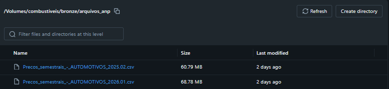

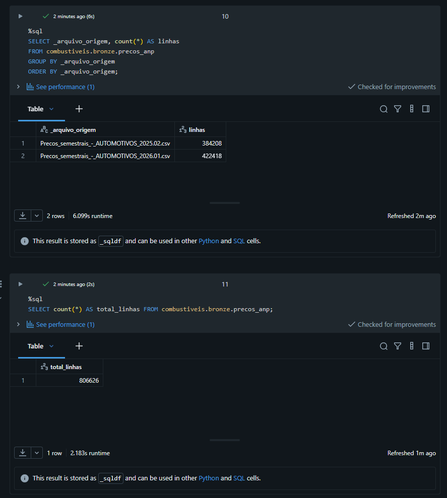

A conferência de carga comparou a contagem por arquivo com a contagem feita nos CSV antes do upload:
384.208 linhas no arquivo de 2025.02 e 422.418 no de 2026.01, totalizando 806.626. Os números batem,
o que confirma que nenhuma linha se perdeu no caminho até a nuvem.

## Modelagem e Catálogo de Dados (Etapa 4.3)

### Modelo escolhido

Esquema estrela, com uma tabela de fatos e quatro dimensões. O documento completo de desenho, com as
alternativas descartadas e a justificativa de cada decisão, está em [`docs/modelagem.md`](docs/modelagem.md).

A fonte entrega um arquivo plano, com o contexto repetido em cada linha: o endereço de um posto aparece
de novo a cada coleta. Em 806.620 linhas, isso significa repetir o cadastro de 9.189 postos dezenas de
vezes. O esquema estrela separa o evento do contexto, o que reduz a repetição e, principalmente,
organiza o dado no formato que as perguntas pedem, já que todas são do tipo "preço médio por alguma
coisa".

O esquema snowflake foi descartado porque normalizar localidade em tabelas separadas acrescentaria
junções sem ganho prático nesta escala. O modelo plano foi descartado porque é o que a fonte já
entrega.

### Grão

Uma linha da `fato_preco_coleta` é o preço de um combustível, em um posto, em uma data de coleta. É o
nível mais fino que a fonte fornece, e guardar nele mantém todas as agregações possíveis. Se a fato
nascesse agregada por mês e estado, a pergunta P5, que compara postos dentro do mesmo município na
mesma semana, ficaria sem resposta.

### Diagrama

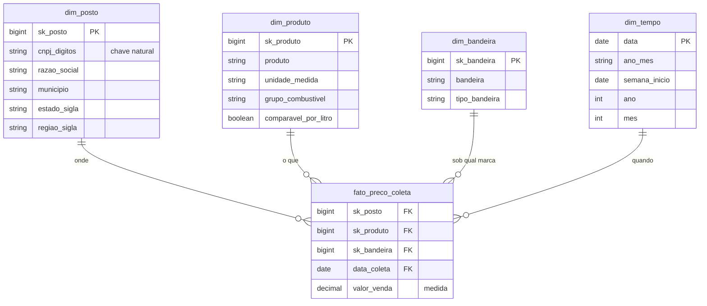

### Duas decisões de modelagem que vieram da análise de qualidade

**A bandeira fica na tabela de fatos, não na dimensão do posto.** O perfil de qualidade encontrou 359
postos que exibiram mais de uma bandeira durante os doze meses. Não é erro: o posto trocou de
distribuidora. Se a bandeira fosse atributo fixo do posto, todo o histórico dele passaria a aparecer
sob a marca mais recente, e a resposta da P4 seria calculada sobre dado errado.

**A dimensão de posto guarda a versão cadastral mais recente.** É uma dimensão de mudança lenta do
tipo 1: o valor antigo é sobrescrito e não há histórico do atributo. A escolha cabe porque nenhuma das
cinco perguntas depende do endereço anterior de um posto. A bandeira, que muda e importa para a
análise, ficou fora desta dimensão justamente por isso.

### Catálogo de dados

Todas as 10 tabelas e as 83 colunas do projeto têm descrição gravada no Unity Catalog, por
`COMMENT ON TABLE` e `COMMENT ON COLUMN`, no script
[`notebooks/06_catalogo_dados.sql`](notebooks/06_catalogo_dados.sql). Uma consulta de verificação no
`information_schema` confirma que não há coluna sem descrição.

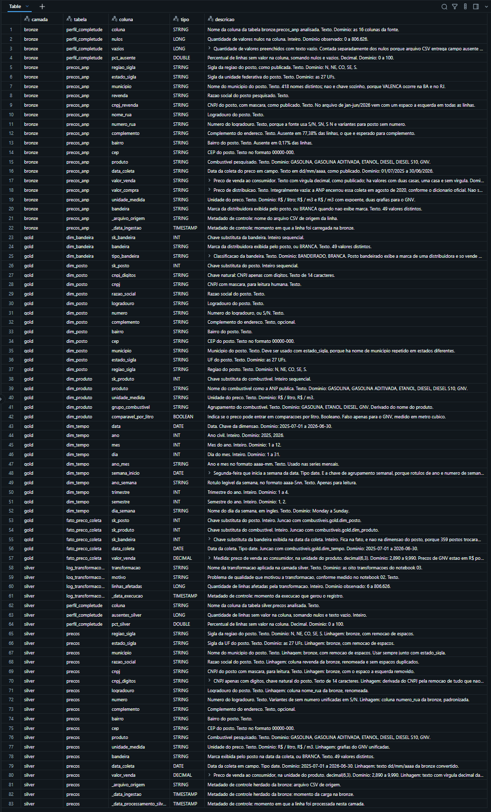

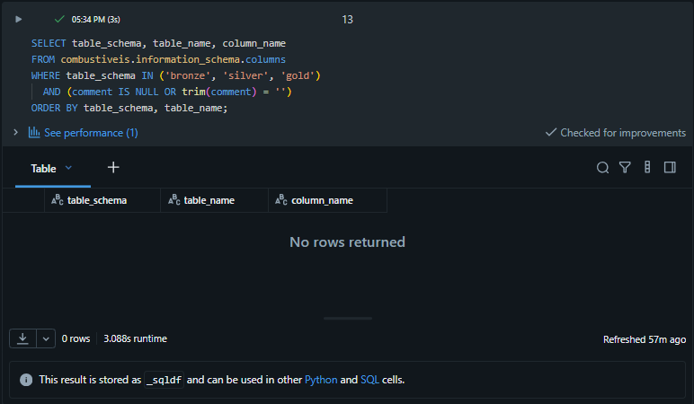

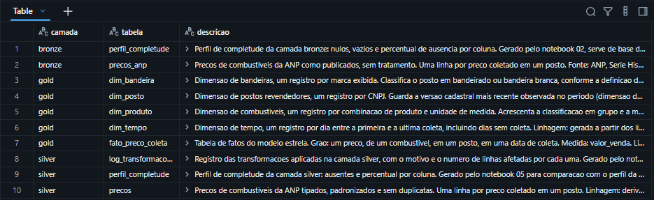

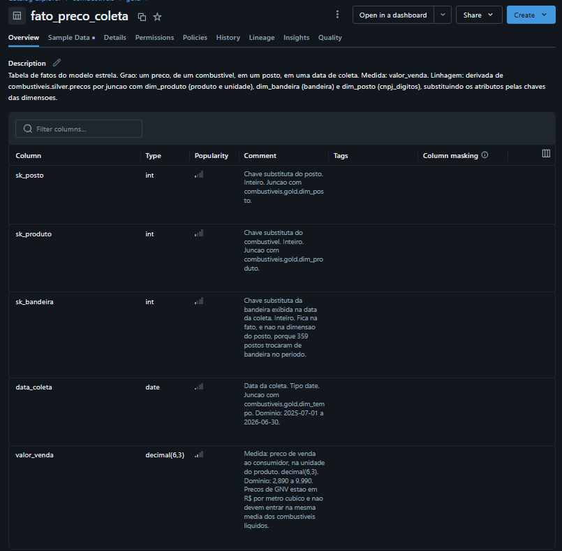

Transcrição do catálogo. Os domínios referem-se ao período carregado, de julho de 2025 a junho de 2026.

#### gold.fato_preco_coleta

Tabela de fatos do modelo estrela. Grão: um preço, de um combustível, em um posto, em uma data de
coleta. Linhagem: derivada de `silver.precos` por junção com `dim_produto` (produto e unidade),
`dim_bandeira` (bandeira) e `dim_posto` (CNPJ apenas com dígitos), substituindo os atributos pelas
chaves das dimensões.

| Campo | Tipo | Descrição e domínio |
|---|---|---|
| sk_posto | bigint | Chave substituta do posto. Junção com `dim_posto` |
| sk_produto | bigint | Chave substituta do combustível. Junção com `dim_produto` |
| sk_bandeira | bigint | Chave substituta da bandeira exibida na data da coleta. Fica na fato, e não na dimensão do posto, porque 359 postos trocaram de bandeira no período |
| data_coleta | date | Data da coleta. Junção com `dim_tempo`. Domínio: 2025-07-01 a 2026-06-30 |
| valor_venda | decimal(6,3) | Medida: preço de venda ao consumidor, na unidade do produto. Domínio: 2,890 a 9,990. Preços de GNV estão em R$ por metro cúbico e não entram na mesma média dos líquidos |

#### gold.dim_posto

Um registro por posto, identificado pelo CNPJ. Guarda a versão cadastral mais recente observada.
Linhagem: derivada de `silver.precos`. 9.189 registros.

| Campo | Tipo | Descrição e domínio |
|---|---|---|
| sk_posto | bigint | Chave substituta, inteiro sequencial |
| cnpj_digitos | string | Chave natural: CNPJ apenas com dígitos, 14 caracteres |
| cnpj | string | CNPJ com máscara, para leitura humana |
| razao_social | string | Razão social do posto |
| logradouro | string | Logradouro do posto |
| numero | string | Número do logradouro, ou S/N |
| complemento | string | Complemento do endereço, opcional |
| bairro | string | Bairro do posto |
| cep | string | CEP no formato 00000-000 |
| municipio | string | Município do posto. Usar com `estado_sigla`, porque há nome repetido entre estados |
| estado_sigla | string | UF do posto. Domínio: as 27 UFs |
| regiao_sigla | string | Região. Domínio: N, NE, CO, SE, S |

#### gold.dim_produto

Um registro por combinação de produto e unidade de medida. Linhagem: derivada de `silver.precos`.
6 registros.

| Campo | Tipo | Descrição e domínio |
|---|---|---|
| sk_produto | bigint | Chave substituta, inteiro sequencial |
| produto | string | Nome do combustível como a ANP publica. Domínio: GASOLINA, GASOLINA ADITIVADA, ETANOL, DIESEL, DIESEL S10, GNV |
| unidade_medida | string | Unidade do preço. Domínio: R$ / litro, R$ / m3 |
| grupo_combustivel | string | Agrupamento derivado do nome. Domínio: GASOLINA, ETANOL, DIESEL, GNV |
| comparavel_por_litro | boolean | Indica se o preço pode entrar em comparações por litro. Falso apenas para o GNV |

#### gold.dim_bandeira

Um registro por marca exibida. Linhagem: derivada de `silver.precos`. 49 registros.

| Campo | Tipo | Descrição e domínio |
|---|---|---|
| sk_bandeira | bigint | Chave substituta, inteiro sequencial |
| bandeira | string | Marca da distribuidora exibida pelo posto, ou BRANCA. 49 valores distintos |
| tipo_bandeira | string | Classificação. Domínio: BANDEIRADO, BRANCA, conforme a definição da ANP |

#### gold.dim_tempo

Um registro por dia entre a primeira e a última coleta, incluindo dias sem coleta. Linhagem: gerada a
partir dos limites de data de `silver.precos`. 365 registros.

| Campo | Tipo | Descrição e domínio |
|---|---|---|
| data | date | Chave da dimensão. Domínio: 2025-07-01 a 2026-06-30 |
| ano | int | Ano civil. Domínio: 2025, 2026 |
| mes | int | Mês. Domínio: 1 a 12 |
| dia | int | Dia do mês. Domínio: 1 a 31 |
| ano_mes | string | Formato aaaa-mm, usado nas séries mensais |
| semana_inicio | date | Segunda-feira que inicia a semana. É a chave de agrupamento semanal, porque rótulos de ano e número de semana são ambíguos na virada do ano |
| ano_semana | string | Rótulo legível da semana, aaaa-Snn, apenas para leitura |
| trimestre | int | Domínio: 1 a 4 |
| semestre | int | Domínio: 1, 2 |
| dia_semana | string | Nome do dia da semana, em inglês |

#### silver.precos

Preços tipados, padronizados e sem duplicatas. Linhagem: derivada de `bronze.precos_anp` por oito
transformações registradas em `silver.log_transformacoes`. 806.620 linhas.

| Campo | Tipo | Descrição e domínio |
|---|---|---|
| regiao_sigla | string | Região do posto. Domínio: N, NE, CO, SE, S |
| estado_sigla | string | UF do posto. Domínio: as 27 UFs |
| municipio | string | Município do posto |
| razao_social | string | Razão social. Origem: coluna `Revenda` da bronze |
| cnpj | string | CNPJ com máscara, sem o espaço à esquerda |
| cnpj_digitos | string | CNPJ apenas com dígitos, chave natural do posto |
| logradouro | string | Origem: coluna `Nome da Rua` da bronze |
| numero | string | Número do logradouro; variantes de sem número unificadas em S/N |
| complemento | string | Complemento do endereço, opcional |
| bairro | string | Bairro do posto |
| cep | string | CEP no formato 00000-000 |
| produto | string | Combustível pesquisado, 6 valores |
| unidade_medida | string | Domínio: R$ / litro, R$ / m3, com as grafias do GNV unificadas |
| bandeira | string | Marca exibida na data da coleta, ou BRANCA |
| data_coleta | date | Convertida do texto dd/mm/aaaa. Domínio: 2025-07-01 a 2026-06-30 |
| valor_venda | decimal(6,3) | Preço ao consumidor. Domínio: 2,890 a 9,990 |
| _arquivo_origem | string | Metadado de controle herdado da bronze |
| _data_ingestao | timestamp | Metadado de controle herdado da bronze |
| _data_processamento_silver | timestamp | Metadado de controle desta camada |

#### bronze.precos_anp

Dado como publicado pela ANP, sem tratamento, com todas as colunas em texto. 806.626 linhas. Os nomes
das colunas foram padronizados na ingestão (o cabeçalho original usa nomes como `Regiao - Sigla` e traz
um marcador BOM no início do arquivo); os valores permanecem intactos. A descrição completa de cada
coluna está gravada no Unity Catalog, e as 16 colunas correspondem às da seção "Estrutura dos dados
brutos", acrescidas de `_arquivo_origem` e `_data_ingestao`.

#### Tabelas de apoio

| Tabela | Conteúdo |
|---|---|
| `bronze.perfil_completude` | Nulos, vazios e percentual de ausência por coluna da bronze. Gerada pelo notebook 02 |
| `silver.perfil_completude` | Mesma medição na silver. Gerada pelo notebook 05, para comparação |
| `silver.log_transformacoes` | Transformação, motivo e linhas afetadas por cada passo da silver. Gerada pelo notebook 03 |

## Pipeline de Dados (Etapa 4.4)

O pipeline está dividido em oito notebooks, um por etapa, em vez de um único notebook com tudo. A
divisão segue o fluxo entre tabelas: cada notebook lê de uma camada e escreve na seguinte, o que
permite reexecutar apenas a parte afetada quando algo muda e deixa claro, pelo nome do arquivo, onde
procurar cada transformação.

| Notebook | O que faz | Entrada | Saída |
|---|---|---|---|
| [`00_setup_ambiente.sql`](notebooks/00_setup_ambiente.sql) | Cria catálogo, schemas e volume | — | Estrutura do Unity Catalog |
| [`01_bronze_ingestao.py`](notebooks/01_bronze_ingestao.py) | Lê os CSV e grava a bronze | Volume | `bronze.precos_anp` |
| [`02_qualidade_bronze.py`](notebooks/02_qualidade_bronze.py) | Perfil de qualidade do dado bruto | `bronze.precos_anp` | `bronze.perfil_completude` |
| [`03_silver_limpeza.py`](notebooks/03_silver_limpeza.py) | Tipagem, padronização e remoção de duplicatas | `bronze.precos_anp` | `silver.precos`, `silver.log_transformacoes` |
| [`04_gold_modelo_estrela.py`](notebooks/04_gold_modelo_estrela.py) | Monta as dimensões e a fato | `silver.precos` | 5 tabelas em `gold` |
| [`05_qualidade_pos_pipeline.py`](notebooks/05_qualidade_pos_pipeline.py) | Repete as verificações nas tabelas finais | `silver`, `gold` | `silver.perfil_completude` |
| [`06_catalogo_dados.sql`](notebooks/06_catalogo_dados.sql) | Grava as descrições no Unity Catalog e verifica se alguma coluna ficou sem documentação | — | Metadados |
| [`07_analise_perguntas.py`](notebooks/07_analise_perguntas.py) | Responde às cinco perguntas | `gold` | Resultados |

Todas as escritas usam modo `overwrite` e todos os comandos de criação usam `IF NOT EXISTS`. O pipeline
é idempotente: rodar uma vez ou dez vezes produz o mesmo resultado, sem duplicar dados. É o que permite
reexecutar depois de uma falha sem precisar investigar o que já tinha sido processado.

### Transformações da camada silver

Cada transformação corresponde a um problema medido no notebook 02. O número de linhas afetadas é
gravado em `silver.log_transformacoes` a cada execução, e não escrito à mão na documentação.

| # | Transformação | Por quê | Linhas afetadas |
|---|---|---|---|
| 1 | Remoção de duplicatas exatas | Coletas registradas duas vezes puxariam a média do posto | 6 |
| 2 | Padronização de espaços em campos de texto | Espaço à esquerda no CNPJ em todo o arquivo de 2026.01 e espaços duplos em endereços; sem isso o mesmo posto viraria dois registros na dimensão | 461.587 |
| 3 | Conversão do preço para `decimal(6,3)` | Publicado como texto com vírgula decimal, em três formatos diferentes | 806.620 |
| 4 | Conversão da data para `date` | Publicada como texto dd/mm/aaaa; ordenação alfabética colocaria 01/12 antes de 02/07 | 806.620 |
| 5 | Criação do CNPJ apenas com dígitos | Chave natural imune a mudança de máscara na fonte | 806.620 |
| 6 | Unificação da grafia da unidade de medida | GNV publicado com duas grafias, uma em cada arquivo | 17.169 |
| 7 | Padronização do número do logradouro | Quatro variantes de "sem número" na fonte | 86.563 |
| 8 | Descarte da coluna `valor_compra` | Integralmente vazia desde agosto de 2020; mantê-la convida a calcular margem com ela | 806.626 |

### Montagem da camada gold

A fato é montada por três junções com as dimensões, cada uma trocando um atributo descritivo pela
chave substituta correspondente: `dim_produto` por produto e unidade de medida, `dim_bandeira` por
bandeira e `dim_posto` pelo CNPJ apenas com dígitos. A data permanece como chave da dimensão de tempo.

Como as três dimensões são derivadas da própria silver, nenhuma linha pode ficar sem correspondência.
A verificação confirma: a fato tem exatamente as mesmas 806.620 linhas da silver, e nenhuma chave nula.

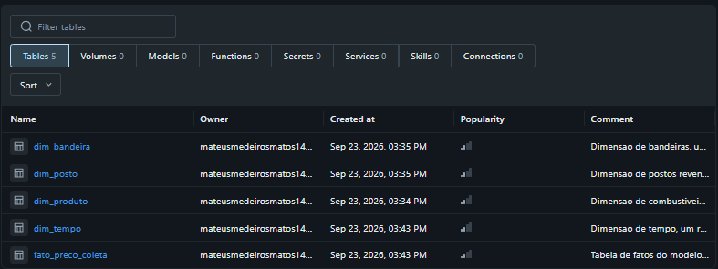

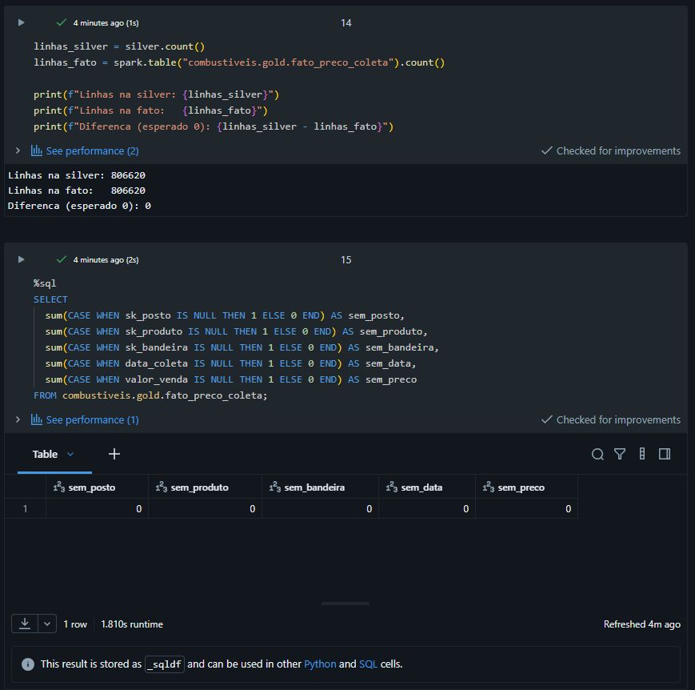

## Qualidade de Dados (Etapa 4.5)

A verificação foi feita em dois momentos: sobre o dado bruto, logo depois da ingestão, e sobre as
tabelas finais, depois do pipeline. Medir só no início prova que havia problema; medir só no fim prova
que está limpo. A comparação entre os dois momentos é o que demonstra o efeito do pipeline.

### O que foi encontrado no dado bruto

Cinco dimensões verificadas para cada atributo, no notebook
[`02_qualidade_bronze.py`](notebooks/02_qualidade_bronze.py).

| Dimensão | Achado |
|---|---|
| Completude | `valor_compra` ausente em 100% das linhas; `complemento` em 77,38%; `bairro` em 0,17% |
| Consistência | 253 preços fora do padrão com vírgula decimal; 422.418 CNPJ com espaço à esquerda; 106.395 números de logradouro não numéricos; duas grafias para a unidade do GNV |
| Unicidade | 6 linhas duplicadas exatas, que também repetem a chave de negócio |
| Acurácia | Nenhum preço nulo ou não positivo; faixas por combustível compatíveis com o mercado; 12 meses de cobertura, sem mês faltando |
| Outliers | Entre 1,36% e 1,94% das coletas fora do intervalo entre o primeiro e o nonagésimo nono percentil de cada produto |

O achado mais relevante não é nenhum desses números isolados, e sim o padrão que eles revelam: **os
dois arquivos vêm do mesmo levantamento, da mesma agência, e não seguem a mesma formatação.** O CNPJ
com espaço aparece em todas as 422.418 linhas do arquivo de janeiro a junho de 2026 e em nenhuma linha
do arquivo anterior. Os 253 preços sem vírgula e os 6.627 com uma casa decimal estão todos no arquivo
de julho a dezembro de 2025. A unidade do GNV é `R$ / m3` em um arquivo e `R$ / m³` no outro.

Nada disso está documentado pela fonte. É a justificativa concreta para a existência da camada silver:
a bronze preserva o que foi publicado, divergências inclusive, e a padronização acontece depois, com
registro. Se a limpeza acontecesse na entrada, a diferença entre os arquivos teria desaparecido sem
deixar rastro, e a próxima mudança de formato da fonte seria descoberta do mesmo jeito, do zero.

### Como cada problema foi tratado

| Problema | Dimensão | Tratamento |
|---|---|---|
| `valor_compra` inteiramente vazia | Completude | Coluna descartada, com o motivo registrado no catálogo |
| `complemento` ausente na maior parte das linhas | Completude | Mantida: complemento opcional em endereço não é defeito |
| Preço como texto, em três formatos | Consistência | Convertido para `decimal(6,3)`; nenhuma conversão perdida |
| Data como texto | Consistência | Convertida para `date` |
| CNPJ com espaço e com máscara | Consistência | Espaço removido, máscara preservada para leitura e versão só com dígitos criada como chave |
| Quatro formas de "sem número" | Consistência | Unificadas em S/N |
| Duas grafias da unidade do GNV | Consistência | Unificadas em `R$ / m3` |
| 6 linhas duplicadas | Unicidade | Removidas |
| Nome de município repetido entre estados | Chave | Localidade sempre identificada pelo par estado e município |
| Posto com mais de uma bandeira no período | Modelagem | Bandeira tratada como atributo da coleta, na tabela de fatos |
| Preços extremos | Outliers | Mantidos, com o intervalo documentado |

### Antes e depois

Verificações repetidas nas tabelas finais, no notebook
[`05_qualidade_pos_pipeline.py`](notebooks/05_qualidade_pos_pipeline.py).

| Verificação | Bronze | Tabelas finais |
|---|---|---|
| Preços fora do padrão | 253 | 0 |
| Datas fora do formato | 0 | 0 |
| CNPJ com espaço | 422.418 | 0 |
| CNPJ sem 14 dígitos | — | 0 |
| Grafias de unidade de medida | 3 | 2 |
| Formas de "sem número" | 4 | 1 |
| Duplicatas da chave de negócio | 6 | 0 |
| Chaves órfãs na fato | — | 0 nas quatro dimensões |
| Linhas | 806.626 | 806.620 |

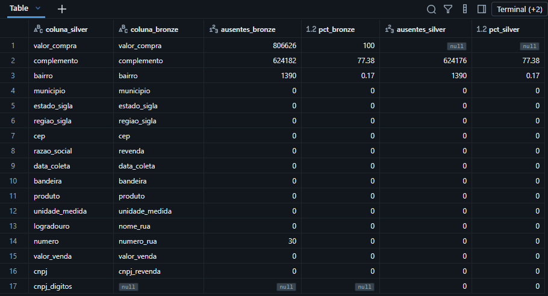

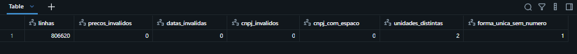

A diferença de seis linhas entre a bronze e as tabelas finais é exatamente a remoção das duplicatas
exatas, e está registrada no log de transformações. Nenhuma outra linha foi perdida: a silver e a fato
têm o mesmo total.

### Por que os outliers foram mantidos

Preço extremo não é sinônimo de erro. A distribuição deles é regional e coerente com o custo logístico
de cada estado.

| Estado | Coletas de gasolina | Acima do percentil 99 | Proporção do estado | Preço médio do estado |
|---|---|---|---|---|
| AC | 625 | 158 | 25,28% | 7,541 |
| RR | 741 | 174 | 23,48% | 7,159 |
| AM | 2.725 | 362 | 13,28% | 7,229 |
| BA | 9.958 | 485 | 4,87% | 6,722 |
| SP | 61.148 | 562 | 0,92% | 6,243 |

Esta tabela ilustra um cuidado de leitura que vale para todo o trabalho. Ordenada por contagem
absoluta, São Paulo aparece em primeiro lugar, com 562 coletas extremas, o que sugeriria que o estado
tem os preços mais atípicos do país. O que ele tem é a maior amostra: 61.148 coletas. Em proporção, SP
fica em 0,92%, enquanto Acre e Roraima passam de 23%. Excluir esses valores como se fossem defeito
apagaria justamente a diferença regional que a pergunta P2 procura medir.

## Análise de Dados (Etapa 4.5)

Consultas no notebook [`07_analise_perguntas.py`](notebooks/07_analise_perguntas.py). O GNV fica fora
de todas as comparações por litro, por ser medido em metro cúbico; a coluna `comparavel_por_litro` da
dimensão de produto sustenta essa regra no modelo, em vez de deixá-la a cargo de quem escreve a
consulta.

### P1 - Evolução mensal do preço por combustível

| Combustível | Jul/2025 | Jun/2026 | Variação | Menor média mensal | Maior média mensal |
|---|---|---|---|---|---|
| Diesel S10 | 6,103 | 7,120 | +16,67% | 6,103 | 7,467 |
| Diesel | 6,050 | 6,874 | +13,63% | 6,048 | 7,339 |
| Gasolina | 6,211 | 6,657 | +7,17% | 6,182 | 6,762 |
| Gasolina aditivada | 6,416 | 6,856 | +6,85% | 6,389 | 6,960 |
| Etanol | 4,376 | 4,447 | +1,62% | 4,366 | 4,868 |

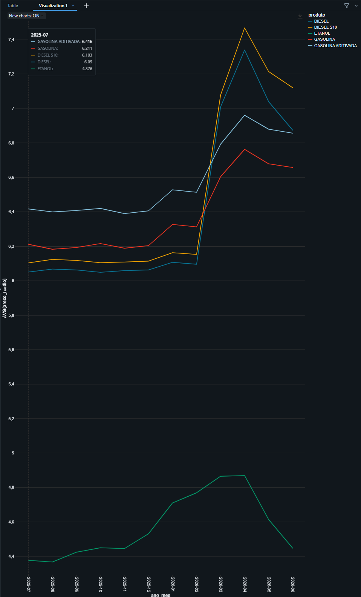

**Discussão.** O ano não foi de alta contínua, e sim de um degrau. Os cinco combustíveis ficaram
praticamente estáveis de julho de 2025 a fevereiro de 2026, saltaram entre março e abril e recuaram
parcialmente depois. O diesel comum saiu de 6,062 em dezembro para 7,009 em março e 7,339 em abril,
fechando junho em 6,874: parte da alta se manteve.

A separação por combustível muda a conclusão para a frota. O diesel, que move os caminhões, subiu mais
que o dobro da gasolina, que move os carros de vendedores. Um reajuste único de orçamento, calculado
pela média geral dos combustíveis, subestimaria o custo da operação pesada e superestimaria o da leve.
São duas rubricas com comportamentos diferentes e devem ser projetadas separadamente.

O etanol, que subiu 1,62% no ano, teve o maior descolamento em relação à gasolina, e é isso que
sustenta a resposta da P3.

### P2 - Estados mais caros e mais baratos

| Combustível | Estado mais caro | Preço | Estado mais barato | Preço | Diferença |
|---|---|---|---|---|---|
| Diesel S10 | AC | 7,848 | SE | 6,269 | R$ 1,579 (25,19%) |
| Gasolina | AC | 7,541 | PI | 6,129 | R$ 1,412 (23,04%) |

Os cinco estados mais caros em diesel S10 são AC (7,848), AM (7,085), RR (7,055), BA (6,819) e RO
(6,771). Quatro deles são da região Norte. São Paulo, com a maior amostra do país, fica 1,14% abaixo
da média nacional.

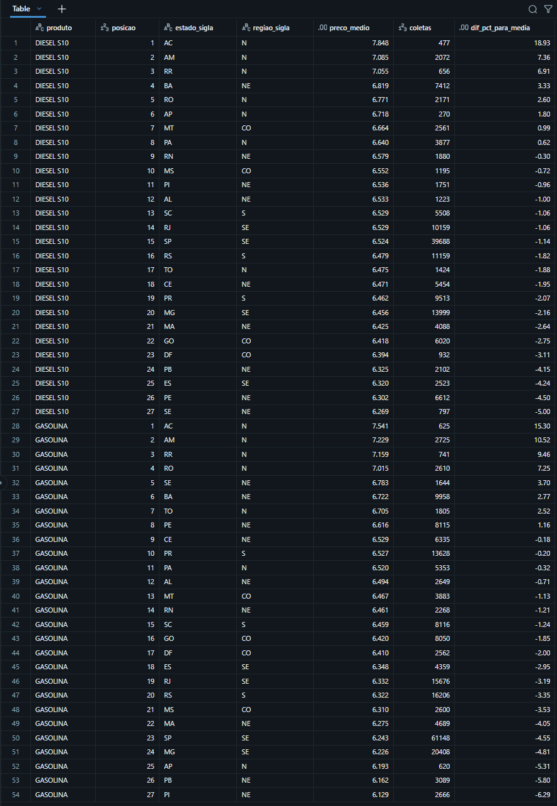

**Discussão.** Abastecer o mesmo caminhão no Acre custa 25% a mais do que em Sergipe. Para uma frota,
isso responde duas coisas de uma vez. Primeiro, o reembolso não pode ser um valor único nacional: hoje
ele ou remunera demais quem roda no Nordeste ou remunera de menos quem roda no Norte. Segundo, em rota
longa que cruza divisa, encher o tanque antes de entrar na região Norte deixa de ser preferência do
motorista e passa a ser procedimento, com economia mensurável.

A concentração dos preços altos no Norte é coerente com a distância dos centros de distribuição de
combustível e com o custo de transporte até lá. Vale registrar que o ICMS estadual também compõe o
preço final e não está nesta base: a diferença medida é o efeito combinado dos dois fatores, e a base
não permite separá-los.

### P3 - Onde compensa abastecer com etanol

Razão entre o preço médio do etanol e o da gasolina, no período completo. Abaixo de 0,70, o etanol
compensa.

| Estado | Etanol | Gasolina | Razão | Decisão | Meses compensando |
|---|---|---|---|---|---|
| MS | 4,173 | 6,310 | 0,6614 | Compensa | 12 de 12 |
| MT | 4,312 | 6,467 | 0,6668 | Compensa | 10 de 12 |
| SP | 4,195 | 6,243 | 0,6720 | Compensa | 10 de 12 |
| PR | 4,513 | 6,527 | 0,6914 | Compensa | 8 de 12 |
| GO | 4,587 | 6,420 | 0,7146 | Não compensa | 5 de 12 |
| MG | 4,464 | 6,226 | 0,7170 | Não compensa | 4 de 12 |
| DF | 4,679 | 6,410 | 0,7285 | Não compensa | 2 de 12 |

Nos 20 estados restantes a razão ficou acima de 0,70 em todos os meses do período.

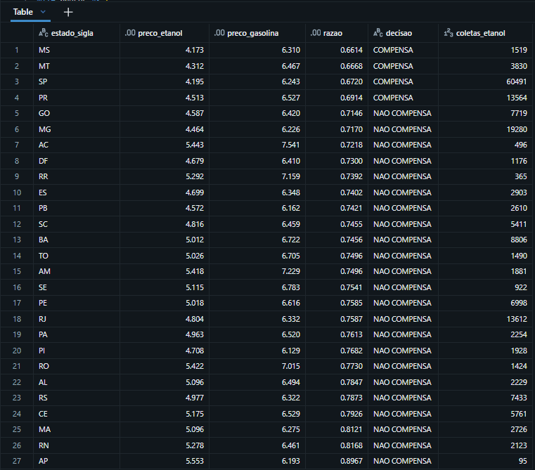

**Discussão.** A política de combustível para a frota flex é regional, não nacional. Em quatro estados
o etanol compensou na média do ano, e todos eles são produtores de cana ou vizinhos imediatos das
usinas: Mato Grosso do Sul, Mato Grosso, São Paulo e Paraná. A proximidade da produção reduz o custo
de transporte do etanol, que é justamente o que o encarece nos estados distantes.

A coluna de meses compensando é mais acionável que a média anual. Mato Grosso do Sul compensou nos 12
meses: lá a regra pode ser fixa. Goiás e Minas Gerais compensaram em 5 e 4 meses, o que significa que
uma regra fixa erra nos dois sentidos, e a decisão precisa ser revista periodicamente. Como a base é
atualizada semanalmente pela ANP e o pipeline é reprocessável, essa revisão pode ser mensal e
automática, em vez de depender de alguém reparar no preço da bomba.

Um alerta de leitura: a regra dos 70% é uma referência de mercado, calculada sobre o rendimento médio
dos motores flex. Um modelo específico pode ter rendimento diferente, e a decisão fina exigiria o
consumo real da frota, que esta base não tem.

### P4 - Bandeirado contra bandeira branca

Comparação feita dentro de cada estado, para a gasolina comum.

| Resultado | Valor |
|---|---|
| Estados comparados | 27 |
| Estados em que a bandeira branca é mais barata | 19 |
| Diferença média | R$ 0,036 por litro (0,65%) |
| Diferença mediana | R$ 0,052 por litro |

Estados com a maior vantagem para a bandeira branca: MS (5,57%), SP (4,56%), PR (3,27%), PA (2,90%),
AC (2,78%) e MT (2,34%).

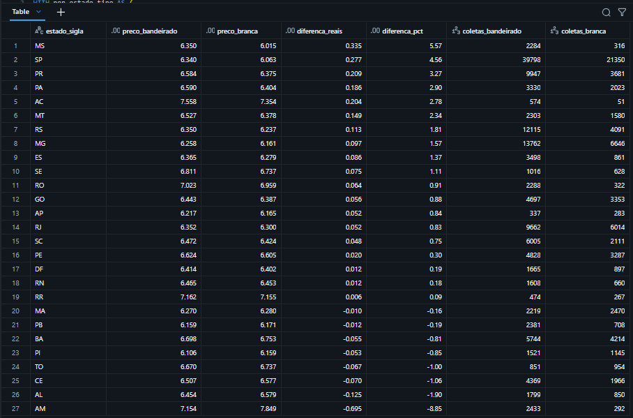

**Discussão.** No agregado, a diferença é pequena: 0,65% em média, menos de quatro centavos por litro.
Essa resposta sozinha sugeriria que a decisão é indiferente. Mas a média nacional esconde o que
interessa: em oito dos 27 estados o posto bandeirado sai mais barato, e em seis estados a bandeira
branca é mais de 2% mais barata. Em Mato Grosso do Sul e São Paulo, onde a frota roda bastante, a
diferença passa de 4%.

A recomendação, então, não é "libere bandeira branca" nem "exija bandeirado", e sim liberar por estado,
onde a diferença for relevante. Vale registrar duas limitações. A comparação foi feita dentro de cada
estado justamente para não confundir efeito de marca com efeito de região, mas dentro de um mesmo
estado ainda pode haver diferença de composição, como bandeira branca mais concentrada no interior.
E preço não é o único critério: contrato de frota costuma envolver rede credenciada, o que pode pesar
mais que quatro centavos por litro.

### P5 - Dispersão dentro do mesmo município

Comparação entre o posto mais barato e o mais caro do mesmo município, na mesma semana, para a gasolina
comum, considerando apenas grupos com pelo menos cinco postos pesquisados.

| Resultado | Valor |
|---|---|
| Grupos município-semana analisados | 17.383 |
| Amplitude média entre o mais barato e o mais caro | R$ 0,473 |
| Amplitude mediana | R$ 0,400 |
| Economia média contra a média local | R$ 0,224 por litro (3,53%) |

Municípios com maior dispersão média:

| Estado | Município | Amplitude média | Amplitude em % |
|---|---|---|---|
| SP | Guarujá | R$ 3,222 | 47,90% |
| SP | São Paulo | R$ 3,189 | 51,07% |
| SP | Barueri | R$ 2,879 | 40,88% |
| RJ | Rio de Janeiro | R$ 2,207 | 35,66% |
| SP | Taboão da Serra | R$ 2,171 | 35,14% |
| PE | Serra Talhada | R$ 1,683 | 26,61% |

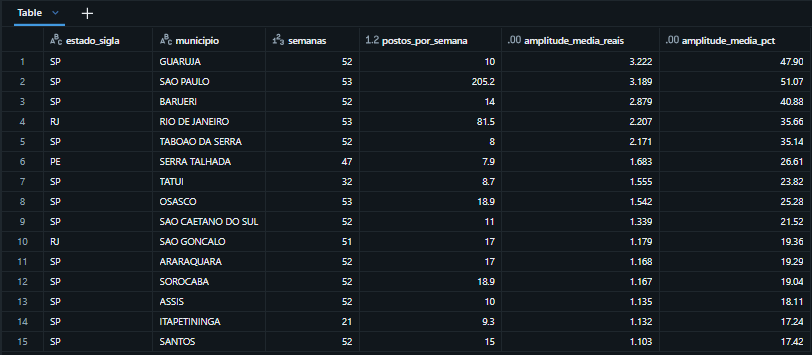

**Discussão.** Escolher onde abastecer dentro da própria cidade vale mais do que parece. Na média, o
posto mais barato do município está 22 centavos abaixo da média local, o que representa 3,53% do valor
gasto. Para uma frota que consome 10 mil litros por mês, são cerca de R$ 2.240 mensais que dependem
apenas de para onde o motorista vira.

Nas capitais e cidades grandes o número é muito maior. Em São Paulo, a diferença média entre o posto
mais barato e o mais caro na mesma semana passa de R$ 3,00 por litro, mais de 50% do preço. Isso ocorre
porque a cidade tem 205 postos pesquisados por semana, e uma amplitude tão grande costuma envolver
postos de perfis muito diferentes, de bairro periférico a rodovia e região central. A leitura correta
não é que exista um posto vendendo pela metade do preço do vizinho, e sim que o mercado local é
heterogêneo o suficiente para que a escolha renda.

É onde há dispersão alta e volume de abastecimento que o convênio com posto se paga. A lista de
municípios acima é, na prática, a fila de prioridade para a área de Compras negociar.

### Discussão geral

As cinco respostas, juntas, transformam o pedido inicial em uma política com quatro regras.

O problema era que a frota não tinha critério de abastecimento e o reembolso era igual no país inteiro.
Os dados mostram que essa uniformidade custa dinheiro em três dimensões independentes: **onde**
abastecer (25% de diferença entre estados), **com o quê** (etanol compensa em quatro estados e só
neles), e **em qual posto** (3,53% de economia média dentro do próprio município, com picos nas
capitais). A quarta regra é temporal: o diesel subiu 16,67% no ano contra 7,17% da gasolina, então as
duas frotas precisam de projeções orçamentárias separadas.

Vale notar que as três primeiras dimensões são acumulativas e de esforço muito diferente. Mudar o
estado de abastecimento depende da rota e nem sempre é possível. Mudar o combustível depende da frota
ser flex e vale para quatro estados. Já escolher o posto dentro da cidade não depende de nada: é a
economia mais fácil de capturar, e também a mais ignorada, porque cada abastecimento individual parece
irrelevante.

Do lado da engenharia de dados, o trabalho também mostrou que a resposta depende de decisões tomadas
antes da análise. A bandeira precisou ficar na tabela de fatos para que a P4 fosse calculável. O grão
precisou ser a coleta individual para que a P5 existisse. E a comparação por proporção, em vez de
contagem absoluta, mudou completamente a leitura dos outliers. Nenhuma dessas decisões aparece no
resultado final, mas todas as três determinam se o resultado está certo.

## Autoavaliação

### Objetivos atingidos

As cinco perguntas definidas no início foram respondidas com os dados carregados, e nenhuma precisou
ser alterada ou removida depois de ver o que a base continha. Isso não é sorte: antes de fixar as
perguntas, conferi quais colunas existiam de fato, o que descartou de saída ideias como calcular a
margem de lucro dos postos, que dependeria da coluna `valor_compra`, vazia desde 2020.

O pipeline roda de ponta a ponta, é idempotente e conserva o volume de dados de forma explicável: as
seis linhas de diferença entre a origem e o destino são as duplicatas removidas, registradas no log.
As dez tabelas e as 83 colunas estão documentadas no Unity Catalog.

### O que ficou de fora

O trabalho usa uma fonte única. Não há junção entre bases diferentes, o que é comum em pipeline de
produção, mas limita a riqueza da linhagem demonstrada.

As respostas ficam no nível descritivo. A P1 mostra que houve um degrau de preço entre março e abril de
2026, e a base não permite explicar por quê: reajuste de refinaria, mudança de tributação e custo de
frete não estão aqui.

A comparação da P4 controla o estado, mas não controla a composição dentro do estado. Uma comparação
mais rigorosa pararia postos bandeirados e de bandeira branca do mesmo município, ou usaria um modelo
que isole o efeito da marca das demais variáveis.

### Dificuldades encontradas

A maior dificuldade não foi técnica, foi de confiança na fonte. Descobrir que dois arquivos do mesmo
levantamento têm formatação diferente, sem nenhum aviso na documentação, muda o jeito de escrever o
pipeline: cada suposição sobre o formato passou a exigir verificação explícita. Foi o que motivou
contar nulos e vazios separadamente e validar formato por expressão regular antes de converter tipo.

A geração da dimensão de tempo falhou na primeira execução, porque o padrão de formatação que eu usei
para o ano da semana foi recusado pelo Spark 3: em datas de virada de ano, o ano do calendário e o ano
da semana divergem, e a versão nova bloqueia o padrão em vez de devolver resultado silenciosamente
diferente. A correção foi identificar a semana pela data da segunda-feira que a inicia, e não pelo
rótulo. Optei por isso em vez de ativar o modo de compatibilidade antigo, que faria o erro sumir sem
resolver a ambiguidade.

Também precisei rever a primeira versão da consulta de outliers, que ordenava por contagem absoluta e
colocava São Paulo no topo por ter a maior amostra. A leitura correta exigia proporção dentro de cada
estado.

### Trabalhos futuros

- Enriquecer o modelo com uma segunda fonte, como população por município do IBGE, para responder se
  cidade maior tem preço menor ou dispersão maior. Exigiria padronizar nome de município, já que a base
  da ANP não traz o código do IBGE.
- Incorporar carga incremental com os arquivos mensais da ANP, demonstrando que o pipeline aceita dados
  novos sem ser reescrito.
- Acrescentar validações automáticas de formato na ingestão, que alertem quando a fonte mudar o padrão,
  em vez de depender de o problema ser notado na análise.
- Cruzar com a alíquota de ICMS de cada estado, para separar o efeito tributário do custo logístico na
  diferença de preço regional.
- Estender a P1 com uma análise de assimetria de reajuste, verificando se o preço sobe mais rápido do
  que cai depois de um choque, como o observado entre março e abril de 2026.
