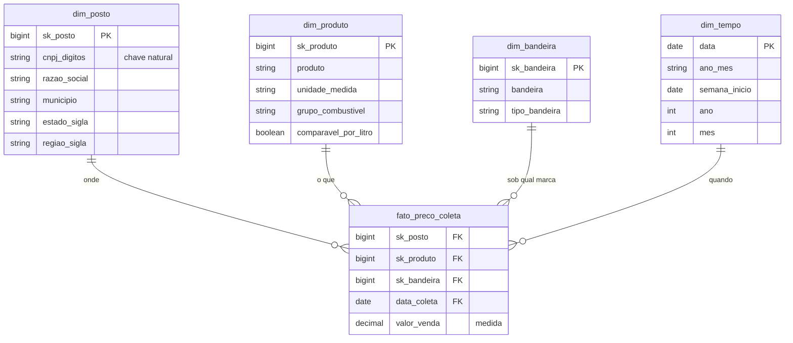

# Modelagem da camada gold

Este documento descreve o modelo dimensional adotado no projeto. Ele foi elaborado antes da
implementação das camadas silver e gold, porque as tabelas de destino determinam quais
transformações a silver precisa fazer.

## Modelo escolhido: esquema estrela

A fonte é um arquivo plano, com uma linha por preço coletado e o contexto repetido em todas as
linhas: o endereço do posto e o nome do município, por exemplo, aparecem novamente a cada coleta.
Nas 806.626 linhas carregadas, o endereço de cada posto se repete dezenas de vezes.

No esquema estrela, os eventos ficam em uma tabela de fatos central, com as medidas e as chaves, e o
contexto fica em tabelas de dimensão, com os atributos descritivos (KIMBALL; ROSS, 2013). O modelo foi
escolhido por três motivos:

1. Todas as perguntas do objetivo envolvem médias de preço agrupadas por algum atributo (mês, estado,
   bandeira, município), que é o tipo de consulta para o qual o esquema estrela é indicado.
2. Os atributos de cada posto passam a ser gravados uma única vez.
3. A correção de um atributo passa a ser feita em um único registro. No arquivo plano, corrigir o
   nome de um posto exigiria alterar todas as linhas dele.

O esquema snowflake foi descartado. Separar município e estado em tabelas próprias reduziria a
redundância, mas acrescentaria junções a todas as consultas sem ganho prático nesse volume de dados.
O modelo plano também foi descartado, por ser o formato que a fonte já entrega.

## Grão da tabela de fatos

Cada linha da `fato_preco_coleta` representa o preço de um combustível, em um posto, em uma data de
coleta.

A definição do grão é a decisão central do modelo, porque determina o que pode ser respondido.
Mantendo a coleta individual, todas as agregações continuam possíveis: semana, mês, município, estado
e bandeira. Se a fato fosse gravada já agregada por mês e estado, a P5, que compara postos do mesmo
município na mesma semana, não poderia ser respondida sem reprocessar os dados.

A medida da fato é `valor_venda`, o preço ao consumidor.

## Tabelas

### fato_preco_coleta

| Coluna | Tipo | Descrição |
|---|---|---|
| sk_posto | bigint | Chave para dim_posto |
| sk_produto | bigint | Chave para dim_produto |
| sk_bandeira | bigint | Chave para dim_bandeira, referente à bandeira exibida na data da coleta |
| data_coleta | date | Chave para dim_tempo |
| valor_venda | decimal(6,3) | Preço de venda ao consumidor, na unidade do produto |

### dim_posto

| Coluna | Tipo | Descrição |
|---|---|---|
| sk_posto | bigint | Chave substituta |
| cnpj | string | CNPJ formatado, como a ANP publica |
| cnpj_digitos | string | CNPJ apenas com dígitos, usado como chave natural |
| razao_social | string | Nome empresarial do posto |
| logradouro, numero, complemento, bairro, cep | string | Endereço |
| municipio, estado_sigla, regiao_sigla | string | Localização |

A localização fica na própria dimensão de posto, de forma desnormalizada, o que caracteriza o esquema
estrela: consultas por estado ou por município não exigem junção adicional.

### dim_produto

| Coluna | Tipo | Descrição |
|---|---|---|
| sk_produto | bigint | Chave substituta |
| produto | string | Nome do combustível como a ANP publica |
| unidade_medida | string | R$/litro, ou R$/m3 no caso do GNV |
| grupo_combustivel | string | GASOLINA, ETANOL, DIESEL ou GNV |
| comparavel_por_litro | boolean | Falso para o GNV, cuja unidade é metro cúbico |

A coluna `comparavel_por_litro` foi criada a partir de um problema identificado no perfil de
qualidade: o GNV é medido em metro cúbico. Sem essa indicação, uma média de preço por estado
misturaria unidades diferentes.

### dim_bandeira

| Coluna | Tipo | Descrição |
|---|---|---|
| sk_bandeira | bigint | Chave substituta |
| bandeira | string | Marca exibida pelo posto, ou BRANCA |
| tipo_bandeira | string | BANDEIRADO ou BRANCA |

A chave da bandeira fica na tabela de fatos, e não na dimensão de posto. O perfil de qualidade mostrou
359 postos com mais de uma bandeira nos doze meses, resultado de troca de distribuidora. Se a bandeira
fosse um atributo fixo do posto, todo o histórico apareceria sob a marca mais recente, e a P4 seria
respondida com dados incorretos.

A coluna `tipo_bandeira` separa os postos bandeirados dos postos de bandeira branca e é usada
diretamente na P4.

### dim_tempo

| Coluna | Tipo | Descrição |
|---|---|---|
| data | date | Chave da dimensão |
| ano, mes, dia | int | Componentes da data |
| ano_mes | string | Formato aaaa-mm, usado nas séries mensais |
| semana_inicio | date | Segunda-feira em que a semana começa; chave de agrupamento semanal da P5 |
| ano_semana | string | Rótulo da semana (aaaa-Snn), apenas para leitura |
| trimestre, semestre | int | Agregações de período mais longo |
| dia_semana | string | Nome do dia |

A dimensão de tempo padroniza a definição de mês e de semana em todas as análises e evita repetir o
cálculo das partes da data em cada consulta.

A semana é identificada pela data da segunda-feira em que começa, e não por um rótulo de ano e número
da semana. Na virada do ano, uma mesma semana pode pertencer a dois anos civis, e o rótulo fica
ambíguo; a data não tem esse problema.

## Diagrama

## Chaves substitutas

Cada dimensão tem uma chave própria, numérica e sequencial, em vez de usar o CNPJ ou o nome do produto
como chave na tabela de fatos. Os motivos são:

1. A chave natural pode mudar: um posto pode ter a razão social alterada, e a fonte pode reescrever o
   nome de um produto. A chave substituta protege a fato dessas mudanças.
2. Chaves numéricas ocupam menos espaço e tornam as junções mais eficientes do que chaves de texto.
3. É a prática usual em data warehouse (KIMBALL; ROSS, 2013), o que facilita a leitura do modelo.

A chave natural continua gravada na dimensão para rastreabilidade: `cnpj_digitos` na dim_posto e o
nome do produto na dim_produto.

## Como cada pergunta é respondida

| Pergunta | Tabelas usadas | Caminho |
|---|---|---|
| P1 - evolução mensal do preço por combustível | fato, dim_produto, dim_tempo | Média de `valor_venda` por `ano_mes` e produto |
| P2 - estados mais caros e mais baratos | fato, dim_posto, dim_produto | Média por `estado_sigla`, filtrando gasolina comum e diesel S10 |
| P3 - onde o etanol compensa | fato, dim_posto, dim_produto, dim_tempo | Razão entre a média do etanol e a da gasolina, por estado e por mês, comparada ao limite de 70% |
| P4 - bandeirado contra bandeira branca | fato, dim_bandeira, dim_posto, dim_produto | Média por `tipo_bandeira`, comparada dentro do mesmo estado |
| P5 - dispersão dentro do município | fato, dim_posto, dim_tempo, dim_produto | Mínimo e máximo por município, semana e produto, com um número mínimo de postos por grupo |

No caso da P4, comparar a média nacional dos postos bandeirados com a dos postos de bandeira branca
misturaria o efeito da marca com o efeito regional, porque os dois tipos de posto não estão
distribuídos igualmente entre os estados. Por isso a comparação é feita dentro de cada estado.

## Transformações necessárias para este modelo

| Transformação | Camada | Motivo |
|---|---|---|
| Converter o preço para decimal, tratando vírgula decimal, uma ou duas casas e valores inteiros sem vírgula | silver | Medida da fato |
| Converter a data para o tipo date | silver | Chave da dim_tempo |
| Remover o espaço à esquerda do CNPJ e gerar a versão apenas com dígitos | silver | Chave natural da dim_posto |
| Padronizar a unidade do GNV, publicada com duas grafias | silver | Atributo da dim_produto |
| Remover as linhas duplicadas exatas | silver | Integridade da fato |
| Padronizar o número do logradouro quando não for numérico | silver | Atributo da dim_posto |
| Descartar `valor_compra` | silver | Coluna inteiramente vazia desde 2020 |
| Classificar o produto em grupo e indicar o que é comparável por litro | gold | Atributos da dim_produto |
| Classificar a bandeira em BANDEIRADO ou BRANCA | gold | Atributo da dim_bandeira |

## Referência

KIMBALL, Ralph; ROSS, Margy. **The data warehouse toolkit**: the definitive guide to dimensional
modeling. 3. ed. Indianapolis: Wiley, 2013.
