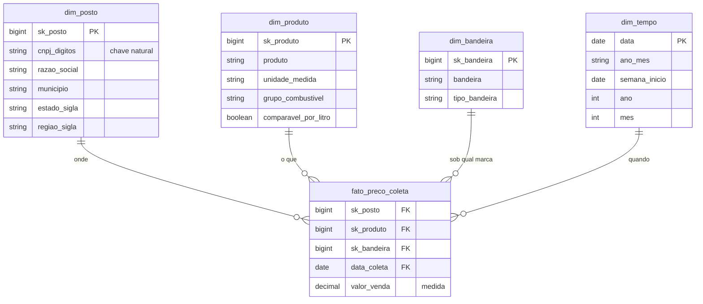

# Modelagem da camada gold

Documento de desenho do modelo dimensional. Define o que cada tabela representa antes de o pipeline
ser escrito, porque são as tabelas de destino que determinam quais transformações a camada silver
precisa fazer.

## Modelo escolhido: esquema estrela

A fonte entrega um arquivo plano, com uma linha por preço coletado e o contexto repetido em todas as
linhas: o endereço do posto aparece de novo a cada coleta, o nome do município a cada linha, e assim
por diante. Em 806.626 linhas, isso significa repetir o endereço de 7.963 postos dezenas de vezes.

O esquema estrela separa o que é evento do que é contexto: uma tabela de fatos no centro, com as
medidas e as chaves, e tabelas de dimensão ao redor, com os atributos descritivos. Foi o modelo
escolhido por três motivos:

1. As perguntas do objetivo são todas do tipo "média de preço por alguma coisa" (por mês, por estado,
   por bandeira, por município). Esse é exatamente o padrão que o esquema estrela otimiza.
2. O contexto deixa de ser repetido. Os atributos de cada posto ficam gravados uma vez.
3. Corrigir um atributo passa a ser uma operação em um lugar só. No arquivo plano, corrigir o nome de
   um posto significa alterar todas as linhas dele.

O esquema snowflake foi descartado: normalizar município em uma tabela e estado em outra reduziria
ainda mais a redundância, mas acrescentaria junções a cada consulta sem ganho prático nesta escala.
O modelo plano foi descartado porque é o que a fonte já entrega, e mantê-lo não demonstraria modelagem.

## Grão da tabela de fatos

Uma linha da `fato_preco_coleta` representa **o preço de um combustível, em um posto, em uma data de
coleta**.

O grão é a decisão mais importante do modelo, porque define o que pode ser respondido. Ao guardar a
coleta individual, qualquer agregação continua possível: semana, mês, município, estado, bandeira.
Se a fato já nascesse agregada por mês e estado, a pergunta P5, que compara postos dentro do mesmo
município na mesma semana, ficaria sem resposta, e não haveria como voltar atrás sem reprocessar.

Medida da fato: `valor_venda`, o preço ao consumidor.

## Tabelas

### fato_preco_coleta

| Coluna | Tipo | Descrição |
|---|---|---|
| sk_posto | bigint | Chave para dim_posto |
| sk_produto | bigint | Chave para dim_produto |
| sk_bandeira | bigint | Chave para dim_bandeira, referente à bandeira exibida na data da coleta |
| data_coleta | date | Chave para dim_tempo |
| valor_venda | decimal(6,3) | Preço de venda ao consumidor, na unidade do produto |

### dim_posto

| Coluna | Tipo | Descrição |
|---|---|---|
| sk_posto | bigint | Chave substituta |
| cnpj | string | CNPJ formatado, como a ANP publica |
| cnpj_digitos | string | CNPJ apenas com dígitos, usado como chave natural |
| razao_social | string | Nome empresarial do posto |
| logradouro, numero, complemento, bairro, cep | string | Endereço |
| municipio, estado_sigla, regiao_sigla | string | Localização |

A localização fica na própria dimensão do posto, desnormalizada. É o que caracteriza a estrela:
consultas por estado ou por município não precisam de uma junção extra.

### dim_produto

| Coluna | Tipo | Descrição |
|---|---|---|
| sk_produto | bigint | Chave substituta |
| produto | string | Nome do combustível como a ANP publica |
| unidade_medida | string | R$/litro, ou R$/m3 no caso do GNV |
| grupo_combustivel | string | GASOLINA, ETANOL, DIESEL ou GNV |
| comparavel_por_litro | boolean | Falso para o GNV, cuja unidade é metro cúbico |

A coluna `comparavel_por_litro` existe por causa de um problema encontrado no perfil de qualidade: o
GNV é medido em metro cúbico. Sem essa marcação, uma média de preço por estado misturaria unidades
diferentes e produziria um número sem significado.

### dim_bandeira

| Coluna | Tipo | Descrição |
|---|---|---|
| sk_bandeira | bigint | Chave substituta |
| bandeira | string | Marca exibida pelo posto, ou BRANCA |
| tipo_bandeira | string | BANDEIRADO ou BRANCA |

A chave da bandeira fica na tabela de fatos, não na dimensão do posto. O perfil de qualidade mostrou
359 postos que exibiram mais de uma bandeira durante os doze meses, o que não é erro: o posto trocou
de distribuidora. Se a bandeira fosse atributo fixo do posto, todo o histórico dele passaria a
aparecer sob a bandeira mais recente, e a pergunta P4 seria respondida com dados errados.

A coluna `tipo_bandeira` resolve a P4 diretamente, separando postos de marca dos de bandeira branca.

### dim_tempo

| Coluna | Tipo | Descrição |
|---|---|---|
| data | date | Chave da dimensão |
| ano, mes, dia | int | Componentes da data |
| ano_mes | string | Formato aaaa-mm, usado nas séries mensais |
| semana_inicio | date | Segunda-feira que inicia a semana; é a chave de agrupamento semanal da P5 |
| ano_semana | string | Rótulo legível da semana (aaaa-Snn), apenas para leitura |
| trimestre, semestre | int | Agregações mais largas |
| dia_semana | string | Nome do dia |

Uma dimensão de tempo evita repetir extração de partes da data em cada consulta e padroniza o que é
"mês" e o que é "semana" em todas as análises.

A semana é identificada pela data da segunda-feira que a inicia, e não por um rótulo do tipo
ano mais número da semana. Na virada do ano, a mesma semana pertence a dois anos civis e qualquer
convenção de nome fica ambígua; uma data não fica.

## Diagrama

## Chaves substitutas

Cada dimensão tem uma chave própria, numérica e sequencial, em vez de usar o CNPJ ou o nome do produto
como chave da fato. Três motivos:

1. A chave natural pode mudar. Um posto pode ter a razão social alterada; o nome de um produto pode ser
   reescrito pela fonte. A chave substituta isola a fato dessas mudanças.
2. Chave numérica ocupa menos espaço e faz junção mais rápido que texto.
3. É o padrão de data warehouse, o que torna o modelo legível para quem já trabalha com o assunto.

A chave natural continua gravada na dimensão, para rastreabilidade: `cnpj_digitos` em dim_posto e o
nome do produto em dim_produto.

## Como cada pergunta é respondida

| Pergunta | Tabelas usadas | Caminho |
|---|---|---|
| P1 - evolução mensal do preço por combustível | fato, dim_produto, dim_tempo | Média de `valor_venda` por `ano_mes` e produto |
| P2 - estados mais caros e mais baratos | fato, dim_posto, dim_produto | Média por `estado_sigla`, filtrando gasolina comum e diesel S10 |
| P3 - onde o etanol compensa | fato, dim_posto, dim_produto, dim_tempo | Razão entre a média do etanol e a da gasolina, por estado e por mês, comparada ao limite de 70% |
| P4 - bandeirado contra bandeira branca | fato, dim_bandeira, dim_posto, dim_produto | Média por `tipo_bandeira`, comparada dentro do mesmo estado para não confundir marca com região |
| P5 - dispersão dentro do município | fato, dim_posto, dim_tempo, dim_produto | Mínimo e máximo por município, semana e produto, com um mínimo de postos por grupo |

A P4 tem uma armadilha registrada aqui de propósito: comparar a média geral de bandeirados com a de
bandeira branca confunde o efeito da marca com o da região, porque a distribuição dos dois tipos não é
igual entre os estados. A comparação precisa ser feita dentro do mesmo estado.

## O que a silver precisa entregar para este modelo funcionar

| Transformação | Motivo |
|---|---|
| Converter preço para decimal, tratando vírgula decimal, uma ou duas casas e valores inteiros sem vírgula | Medida da fato |
| Converter data para tipo date | Chave da dim_tempo |
| Remover o espaço à esquerda do CNPJ e gerar a versão só com dígitos | Chave natural de dim_posto |
| Padronizar a unidade do GNV, publicada com duas grafias | Atributo de dim_produto |
| Classificar produto em grupo e marcar o que é comparável por litro | Atributos de dim_produto |
| Classificar bandeira em BANDEIRADO ou BRANCA | Atributo de dim_bandeira |
| Remover as linhas duplicadas exatas | Integridade da fato |
| Padronizar o número do logradouro quando não for numérico | Atributo de dim_posto |
| Descartar `valor_compra` | Coluna inteiramente vazia desde 2020 |
